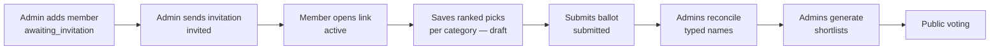

# Academy & nominations

The academy is the expert half of the Rominas vote. Its members are invited by staff, sign in without a
password, nominate five ranked nominees in **every** category, and can propose future members. Once
nominations close, admins turn the submitted ballots into a five-nominee **shortlist** per category, which
is what the public then votes on.

Everything here lives in `app/Modules/Academy/`, split into submodules:

| Submodule | Owns |
| --- | --- |
| `Member/` | The `Member` account (its own `member` guard), admin roster CRUD |
| `Nomination/` | A member's ballot (`Nomination`) and its ranked picks (`NominationRanking`) |
| `MemberProposal/` | Members proposing future members; admin review |
| `Shortlist/` | Generating and adjusting the per-category shortlist for public voting |
| module root | `MemberAuthController` (magic-link login) and `SendAcademyInvitationsAction` |

Fields and relationships are in [domain-model.md](domain-model.md#academy); the endpoint and permission
reference is in [access-control.md](access-control.md) §2b–2e. Free-text nominee names are reconciled by a
separate module — see [nominee reconciliation](nominee-reconciliation.md).

## 1. Members and their lifecycle

A `Member` is a **participant account**, separate from the admin `User`: its own table, its own Sanctum
guard (`member`), no password column. A token minted for one population is rejected by the other's guard.

`MemberStatus` normally moves forward as below. An admin can also set any status directly through the
roster update (`PATCH /api/admin/members/{member}`), which is how a member is suspended.

| Status | Entered when | Can sign in? |
| --- | --- | --- |
| `awaiting_invitation` | An admin creates the member, or approves a proposal (§5) | Yes, if they request a link — but they have not been told to |
| `invited` | An admin sends the invitation email | Yes |
| `active` | The member's first successful magic-link verify (also stamps `email_verified_at`, `activated_at`) | Yes |
| `suspended` | An admin sets it via the roster update | **No** — verify returns 422 |

Admins manage the roster under `/api/admin/members` (the `members` permission, held by `admin`).

## 2. Magic-link sign-in

Members authenticate with a **guard-agnostic** magic-link primitive that lives in `Auth/MagicLink/`, so the
future `critic` guard can reuse it unchanged.

1. **Request** — `POST /api/academy/auth/magic/request {email}`, throttled to 5/min per email + IP
   (`magic-request` limiter). The controller queues a `SendMagicLinkJob` and **always answers 200** with the
   same message.
2. **Issue** — `SendMagicLinkAction` looks the email up through the guard's own auth provider. The system is
   **closed**: an unknown address silently gets nothing, which is why step 1 cannot leak whether an account
   exists. It stores a bcrypt-hashed 48-character random token in `magic_link_tokens`, one row per
   `(email, guard)`, with its own `expires_at`, and sends the email through the `Delivery` pipeline. A
   still-valid link issued in the last 60 seconds is kept and not re-sent (resend cooldown).
3. **Verify** — `POST /api/academy/auth/magic/verify {email, token}`. `VerifyMagicLinkAction` checks expiry
   and the hash, then **deletes the row** (single use). The controller refuses suspended members, activates
   the account on first login and returns `{memberId, token}` — a Sanctum token with the `member` ability.
   Any failure is one generic 422.
4. **Session** — `GET /api/academy/me` and `POST /api/academy/logout` (revokes the current token) run under
   `auth:member`.

**Link lifetime** is chosen per email type from `config/magic-link.php` when the link is issued: 15 minutes
for sign-in links (`MAGIC_LINK_TTL_MINUTES`), 48 hours for invitations (`MAGIC_LINK_INVITATION_TTL_MINUTES`).
Verification only reads the stored `expires_at`, so changing the config never affects links already sent.
Because there is one row per `(email, guard)`, requesting a sign-in link replaces an unused invitation link.

Login, logout and link requests are recorded in the [audit trail](audit.md); the attempted email is stored
only as a hash.

## 3. Invitations

Invitations are a **manual admin action, not tied to the edition lifecycle** — typically sent before
nominations open.

- **Bulk** — `POST /api/admin/members/invitations`: `SendAcademyInvitationsAction` invites every
  `awaiting_invitation` member, moves each to `invited`, and returns the count. Each email is a queued
  `SendMagicLinkJob` dispatched **after commit**, so the job never reads a row that is not yet saved.
- **Single** — `POST /api/admin/members/{member}/invite`: invites one member. It also works as a resend for
  an already-invited member (status unchanged, `invited_at` re-stamped). The magic-link resend cooldown still
applies: if the previous link was issued under 60 seconds ago and is still valid, no new email goes out.

The invitation is itself a magic link (`academy-invitation-email`), so opening it signs the member in.

## 4. Ranked nominations

A member has **one ballot (`Nomination`) per edition**, created on the first save. It holds up to five
ranked picks per category (`NominationRanking`, rank 1 = top).

### The open window

Every write goes through `ResolveOpenNominationEditionAction`, which requires:

- an active edition whose status is `nominations_open`, **and**
- now within `[nominations_start_at, nominations_end_at]`.

Otherwise the request is a 422 on `nominations`. Reading the ballot is allowed at any time. See
[edition-lifecycle.md](edition-lifecycle.md) for the statuses and timeline.

### Save and resume

`PUT /api/academy/nominations/categories/{category}` with `{"nominees": ["Name one", "Name two", …]}` —
up to five **free-text names**, array order = rank. An empty array clears the category.
`SaveCategoryRankingAction`:

1. checks the window, that the category belongs to the open edition, and that the ballot is still `draft`;
2. in one transaction, deletes the category's existing picks and re-creates them;
3. maps each typed name to a `NomineeSubmission` via `ResolveOrCreateNomineeSubmissionAction` — one shared
   row per `(edition, nominee type, normalized name)`, so "Delia", "delia" and " Delia! " all land on the
   same submission;
4. stores the ranking pointing at that submission, with `nominee_id` copied from the submission — **null
   while the name is pending**, or already filled if an admin reconciled the same name earlier.

Two names on one category that normalize to the same submission are refused ("Two of your picks refer to
the same nominee"); exact repeats are already blocked by the Form Request's `distinct` rule.

The response is always the **whole ballot** (`GET /api/academy/nominations` returns the same shape): every
category of the active edition with the member's picks, each showing the `raw_name` typed, its
`submission_status`, and the resolved `nominee` once reconciled. With no saved ballot yet, an empty draft is
synthesized for display and not persisted.

### Submit

`POST /api/academy/nominations/submit` → `SubmitNominationAction`: the window must be open and the ballot a
draft, and **every category of the edition must hold exactly five picks**. Otherwise the 422 names the
incomplete categories. On success the ballot becomes `submitted` with `submitted_at` set — terminal, no
further edits.

Only **submitted** ballots count anywhere downstream (shortlist, scoring, reporting). Drafts left at the
deadline are ignored.

## 5. Member proposals

Members can propose future academy members at any time; the pool is not tied to an edition.

- **Member side** (`auth:member`, own proposals only): `POST /api/academy/proposals` (`name`, `email`
  required; `position`, `company`, `phone`, `reason` optional), `GET` to list, and
  `DELETE /api/academy/proposals/{proposal}` to withdraw a **pending** one (audited).
- **Limits** (`CreateMemberProposalAction`): a **lifetime cap** per member of
  `config('academy.max_proposals_per_member')`, default 5 — every proposal ever made counts, whatever its
  status, so withdrawing does not free a slot. The email must not already be a member or have a pending
  proposal.
- **Admin review** (`memberProposals` permission, held by `admin`): list (`?status=`), view, then
  `approve` or `reject`, each with an optional `note`. Only pending proposals can be reviewed.
  **Approving creates an `awaiting_invitation` Member** from the proposal's name and email (reusing
  `CreateMemberAction`) and links it on `member_id`. That member then goes through the normal invitation
  flow (§3).

## 6. The shortlist

The shortlist bridges the academy round and public voting: per category, the **top five nominees by summed
academy points** become the candidates the public ranks.

### Points

`Rominas\Scoring\RankPoints::forRank()` is the single source of the academy curve:
`points = 2 · (6 − rank)` → rank 1 = 10, 2 = 8, 3 = 6, 4 = 4, 5 = 2. `AcademyPointTally` sums it per nominee
over **submitted** ballots only, and only over **resolved** picks (`NominationRanking::resolved()`, i.e.
`nominee_id` not null). A pick whose name was rejected during reconciliation therefore counts for nothing.

### Generate

- `POST /api/admin/editions/{edition}/categories/{category}/shortlist` — one category
  (`GenerateCategoryShortlistAction`).
- `POST /api/admin/editions/{edition}/shortlist` — every category, in one transaction
  (`GenerateEditionShortlistsAction`).

Generation orders nominees by points descending, ties broken by nominee id ascending, keeps the top five,
and **replaces** any existing entries for the category. It is refused (422) unless:

- the edition is **`nominations_closed`** — nominations are frozen and voting has not opened; and
- **no nominee submission for the edition is still `pending`** — otherwise an unreconciled name would be
  silently dropped from the tally.

Generation is an explicit admin action; nothing runs automatically on the status change.

### Review and adjust

Ties at the cut-off, or any other editorial call, are settled by hand:

- `GET …/categories/{category}/shortlist/candidates` — the full candidate pool: every nominee with at least
  one academy pick, ranked the same way, with name, slug, points and rank.
- `PUT …/categories/{category}/shortlist` with `{"nominees": [ids in order]}` — `AdjustCategoryShortlistAction`
  replaces the shortlist with at most five nominees, in that order. Each id must exist in the category's
  Catalog type; its `points` are re-derived from the tally (0 for a nominee the academy never picked).

Same `nominations_closed` guard. **Once voting opens the shortlist is frozen**, because every write endpoint
fails the status check. `GET /api/admin/editions/{edition}/shortlist` shows the result, alongside
`meta.rejected_picks` — a `category_id => count` map of submitted rankings whose free-text pick was
rejected during reconciliation (`CountRejectedPicksAction`), so a category short of picks because of a
rejection stays visible even after generation, not just as a one-time warning in the reconciliation queue.
See [nominee-reconciliation.md §5](nominee-reconciliation.md#5-the-shortlist-interlock).

All shortlist endpoints use the `shortlists` permission (held by `admin`).

### What depends on the shortlist

- **Voting** offers exactly the shortlisted nominees, alphabetically, so the academy order is not revealed
  ([voting.md](voting.md)).
- **Scoring** scores only shortlisted nominees, and the default algorithm uses the shortlist **position**,
  so a manual reorder carries through to the final result ([scoring-results.md](scoring-results.md)).

## 7. Files

| Concern | Where |
| --- | --- |
| Magic-link primitive | `Auth/MagicLink/Actions/{Send,Verify}MagicLinkAction.php`, `Jobs/SendMagicLinkJob.php` |
| Member login | `Academy/Controllers/MemberAuthController.php`, `routes/api/academy/auth.php` |
| Invitations | `Academy/Actions/SendAcademyInvitationsAction.php`, `routes/api/admin/members.php` |
| Nominations | `Academy/Nomination/`, `routes/api/academy/nominations.php` |
| Proposals | `Academy/MemberProposal/`, `routes/api/academy/proposals.php`, `routes/api/admin/member-proposals.php` |
| Shortlist | `Academy/Shortlist/`, `routes/api/admin/shortlist.php` |
| Config | `config/magic-link.php` (link lifetimes), `config/academy.php` (proposal cap) |
