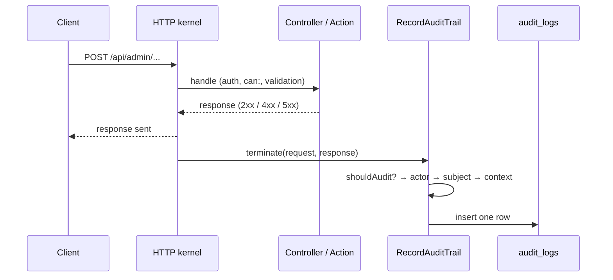

# Audit trail

The `Audit` module keeps a single, **append-only** record of **who did what**: every state-changing admin
action, the sensitive admin reads (viewing/exporting final results), and the authentication and
account-lifecycle events of both admins and academy members. It exists to satisfy the ecosystem rule that
sensitive actions — especially vote cancellations and any access to final results — are audited
(ecosystem `CLAUDE.md` §5–6).

Everything here lives in `app/Modules/Audit/`, with its settings in `config/audit.php`. For the
`AuditLog` field reference see [domain-model.md](domain-model.md#audit-cross-cutting-trail); for the
read permission see [access-control.md](access-control.md#2i-audit-trail-the-audit-module).

| Piece | File | Role |
| --- | --- | --- |
| Middleware | `Middleware/RecordAuditTrail.php` | The **sole writer** — records one row per audited request |
| Model | `Model/AuditLog.php` | One audited request (table `audit_logs`) |
| Query builder | `QueryBuilders/AuditLogQueryBuilder.php` | Filters: causer, action, subject, date range, permission scope |
| Hasher | `Support/AuditHasher.php` | HMAC-pseudonymizes attempted emails on auth routes |
| Policy | `Policies/AuditLogPolicy.php` | `viewAny` / `view` gated by the `audit` permission |
| Controller + resource | `Controllers/AuditLogsController.php`, `Resources/AuditLogResource.php` | Read-only admin API |
| Config | `config/audit.php` | Coverage lists, actor resolution, redaction, hashing, size cap |

## 1. How a row gets written

There is no `AuditLog::create()` anywhere in the domain code. Recording is a cross-cutting concern handled
by one **terminable middleware**, `RecordAuditTrail`, aliased as `audit` in `bootstrap/app.php`.

- `handle()` does nothing but pass the request on.
- `terminate()` runs **after the response has been sent** to the client, so auditing adds no latency. It
  works off the **final, rendered response**, which means failures are recorded with their real status code:
  a 403 denial, a 422 validation error or a 500 all produce a row.



The middleware is attached in `routes/api.php` to:

- the whole **`/admin` group** (`auth:sanctum` + `audit`);
- the admin **`/authenticate`** and **`/logout`** routes;
- the **academy auth** routes (magic-link request/verify) and the **academy proposals** routes.

Being attached is not enough to be recorded — the coverage rules below decide per request.

## 2. What gets recorded (coverage)

Coverage is decided by **route name** (`shouldAudit()`), evaluated in this order:

1. **No route name** → not recorded.
2. Name in **`ignore`** → not recorded. Holds the audit-log read endpoints themselves, so reading the trail
   does not spam it.
3. Name in **`audited`** → recorded, whatever the HTTP method (**opt-in**). This is how routes *outside*
   `/admin` get audited.
4. Name starts with **`api.admin.`** (**opt-out**):
   - `POST` / `PUT` / `PATCH` / `DELETE` → always recorded;
   - `GET` → recorded only if listed in **`audited_reads`**.
5. Anything else → not recorded.

The current lists:

| List | Routes |
| --- | --- |
| `audited` | `api.authenticate`, `api.logout`, `api.academy.auth.magic.request`, `api.academy.auth.magic.verify`, `api.academy.logout`, `api.academy.proposals.withdraw` |
| `audited_reads` | `api.admin.editions.results.show`, `api.admin.editions.results.export` |
| `ignore` | `api.admin.audit-logs.index`, `api.admin.audit-logs.view` |

Consequences worth knowing:

- **Every new admin write endpoint is audited automatically** — as long as it is registered inside the
  `/admin` group and has a route name. Nothing to add to the config.
- **A new admin read is not audited** unless it is added to `audited_reads`. Add it when the read exposes
  something sensitive (final results, exports).
- **A new non-admin route is not audited** unless it carries the `audit` middleware **and** its name is in
  `audited`.
- Public voting (`/api/voting`) and the public results API are deliberately not audited: a ballot carries its
  own state, and the voting module pseudonymizes voters on its own (see the `Voting` domain notes).

## 3. Who did it (the actor)

The actor is **polymorphic and decoupled** — `causer_type` + `causer_id` with **no foreign key**, so the trail
outlives a deleted user or member. `resolveActor()` picks it as follows:

1. **An authenticated model** on the request → its alias from `causer_types` (`User` → `user`,
   `Member` → `member`; unmapped models fall back to the snake-cased class name), its key, and its `name`
   snapshotted into `causer_label` so old rows stay legible.
2. **A login route** — no one is authenticated *during* the request, so the id is recovered from the
   **success** response body (status `< 300`) using `actor_from_response`:
   `api.authenticate` → `userId` (type `user`), `api.academy.auth.magic.verify` → `memberId` (type `member`).
   `causer_label` stays null here.
3. Otherwise → **anonymous**: all three causer columns are null (a failed login, a magic-link request).

## 4. What it was done to (the subject)

`resolveSubject()` walks the route's parameters and takes the **last bound Eloquent model** — the most
specific one. `subject_type` is the **route parameter name** (e.g. `edition`, `proposal`,
`invalidationBatch`), not a class name; `subject_id` is the model key. Routes that bind no model (a
top-level create, a login) have a null subject.

So for `PATCH /api/admin/editions/{edition}/fraud-alerts/{fraudAlert}` the subject is `fraudAlert`, not
`edition`.

The `action` column is the **route name** itself (e.g. `api.admin.editions.transition`) — semantic, stable,
and requiring no enum to maintain. An unnamed route would fall back to `"METHOD path"`, but unnamed routes
are never audited (rule 1 above).

## 5. The `context` payload and personal data

`context` is JSON built by `buildContext()`:

```json
{
  "request": { "...redacted request body...": "..." },
  "...": "any extras pushed via Context (see §6)"
}
```

**Redaction.** Every request-body key, at any depth, is matched case-insensitively against the glob
patterns in `redact` (`password`, `password_confirmation`, `*token*`, `*secret*`, `otp`, `*email*`); a
matching value becomes `"[redacted]"`. Credentials and tokens are never stored, and neither are emails —
the subject reference already identifies the person.

**Email hashing on auth routes.** On the routes in `hash_emails_on` (`api.authenticate`, and the
magic-link request/verify) the attempted email is often the *only* identifier of an anonymous actor. There
the plaintext stays redacted, and an extra `email_hash` is added: an HMAC-SHA256 of the trimmed,
lower-cased email, keyed by `audit.pepper` (`AuditHasher::emailHash()`). It is non-reversible but stable,
so repeated attempts against one address can be correlated without storing it (GDPR, ecosystem §6).

- `audit.pepper` reads `AUDIT_PEPPER`, falling back to `APP_KEY`. **Set a dedicated `AUDIT_PEPPER` in
  production.** Rotating it only breaks correlation with past attempts; nothing else depends on it.
- To look up a known address in the trail, compute `AuditHasher::emailHash($email)` and search for it.

**Size cap.** If the serialized context exceeds `max_context_bytes` (16 KB), the `request` part is dropped
and `_truncated: true` is set; Context extras are kept.

**Per-field GDPR stance** of the other columns:

| Column | Stored as | Why |
| --- | --- | --- |
| `ip_address` | plaintext | Forensic accountability of staff/member actions — the documented §6 exception (voter IPs, by contrast, are hashed by `Voting`) |
| `user_agent` | plaintext, capped at 500 chars | Low sensitivity; helps distinguish sessions |
| `causer_label` | plaintext name snapshot | Keeps rows legible after the actor is deleted |

## 6. Enriching an entry from an Action

An Action (or controller) can add detail to its own audit row **without depending on the Audit module**,
by pushing an array into Laravel's request `Context` under the `audit` key:

```php
use Illuminate\Support\Facades\Context;

$edition->update($data->toArray());

Context::add('audit', ['changes' => $edition->getChanges()]);
```

The middleware merges that array into `context` alongside `request`. This is the extension point for richer
old→new diffs; no middleware change is needed. Note that `Context::add()` replaces the whole `audit` value,
so push a single array per request.

The audit row is a lightweight **pointer**, not a copy of domain state: for vote cancellations the
`InvalidationBatch` (with its mandatory reason) and for fraud signals the `FraudAlert` remain the source of
truth; the audit entry records who triggered the action and when, and links to it through the subject.

## 7. Reading the trail

Read-only admin API, under the Sanctum-guarded `/api/admin/audit-logs` (`routes/api/admin/audit.php`):

| Endpoint | Gate | Returns |
| --- | --- | --- |
| `GET /api/admin/audit-logs` | `can:viewAny,AuditLog` | Paginated trail (25 per page), newest first |
| `GET /api/admin/audit-logs/{auditLog}` | `can:view,auditLog` | A single entry |

Index filters (all optional, combinable):

| Query params | Scope |
| --- | --- |
| `causer_type` + `causer_id` (both required) | `forCauser()` — one actor's activity |
| `action` | `forAction()` — exact route name |
| `subject_type` + `subject_id` (both required) | `forSubject()` — everything done to one resource |
| `from`, `to` | `betweenDates()` — inclusive bounds on `created_at` |

`AuditLogResource` returns every column except `user_agent`, with `created_at` as ISO-8601.

**Who can read it.** Both routes require the `audit` permission, which the `PermissionSeeder` creates but
**grants to no role** — only `super_admin` reads the trail, through the `Gate::before` bypass. This is
deliberate: audited actors (admins, fraud monitors, the custodian) cannot inspect or scrub their own trail.
The admin menu shows the *Audit log* entry only to holders of the permission.

**Append-only.** There are no create/update/delete endpoints and no policy abilities for them. The only
writer is the middleware.

## 8. Checklist when adding routes

- **New admin write endpoint** — give it a route name inside the `/admin` group; it is audited
  automatically. If the Action has meaningful before/after state, push it via `Context::add('audit', …)`.
- **New sensitive admin read** (results, exports, bulk personal data) — add its name to `audited_reads`.
- **New auth / account-lifecycle route outside `/admin`** — add the `audit` middleware and its name to
  `audited`. If it logs someone in, add it to `actor_from_response`; if it receives an email from an
  anonymous caller, add it to `hash_emails_on`.
- **New request field carrying a secret or personal data** — make sure a `redact` pattern matches its key.
- **New authenticatable model** — map it in `causer_types` to a stable alias.
- Cover the new behaviour in `tests/Feature/AuditTest.php`.
