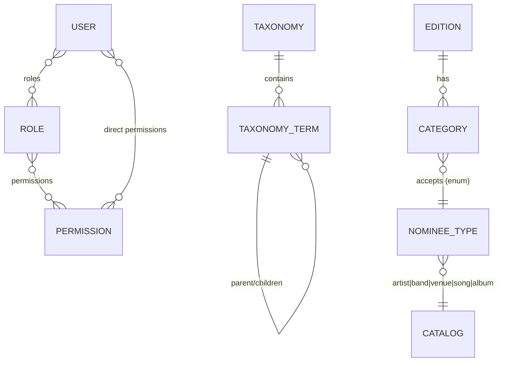
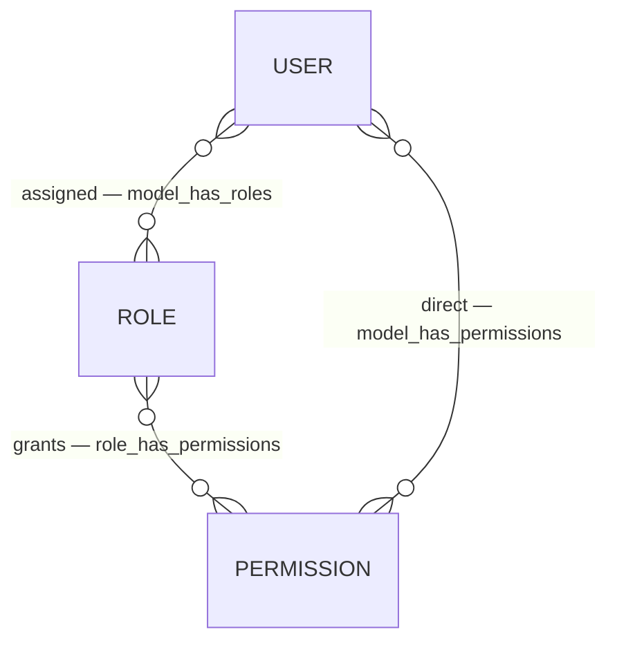
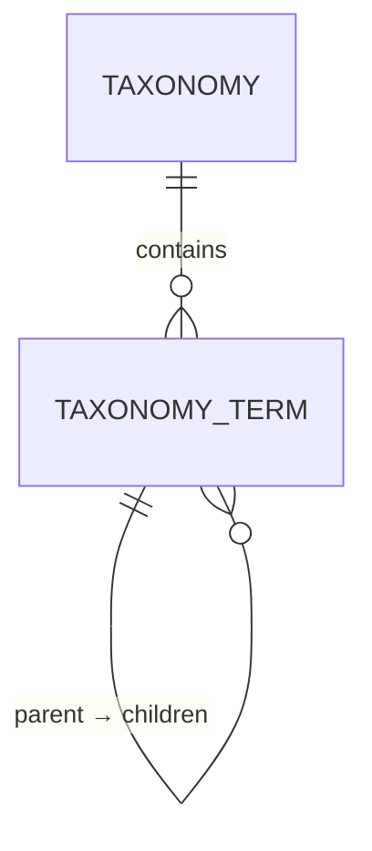
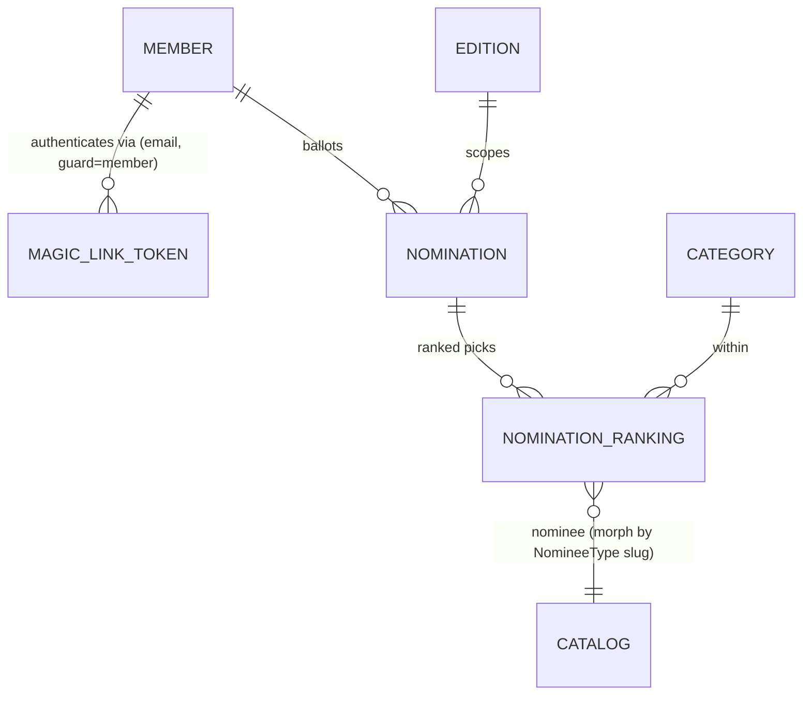
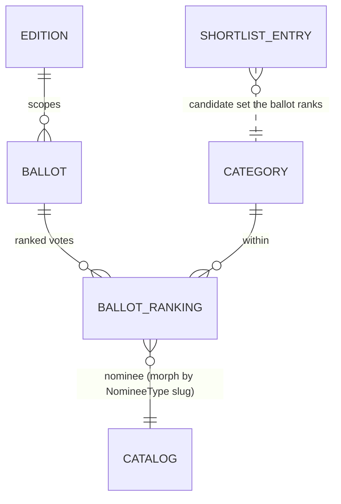
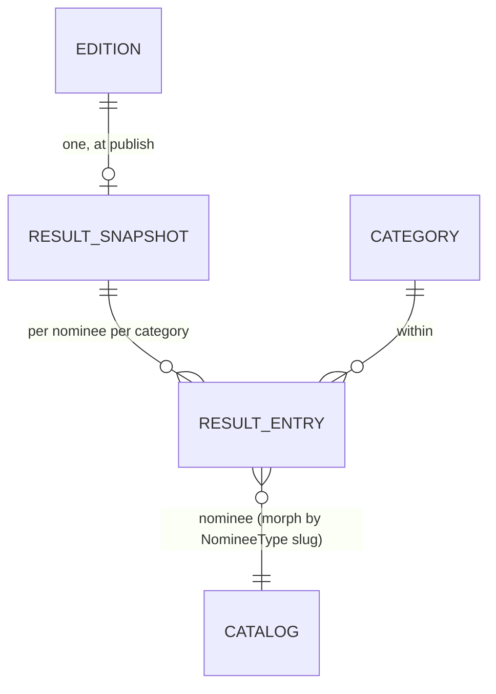
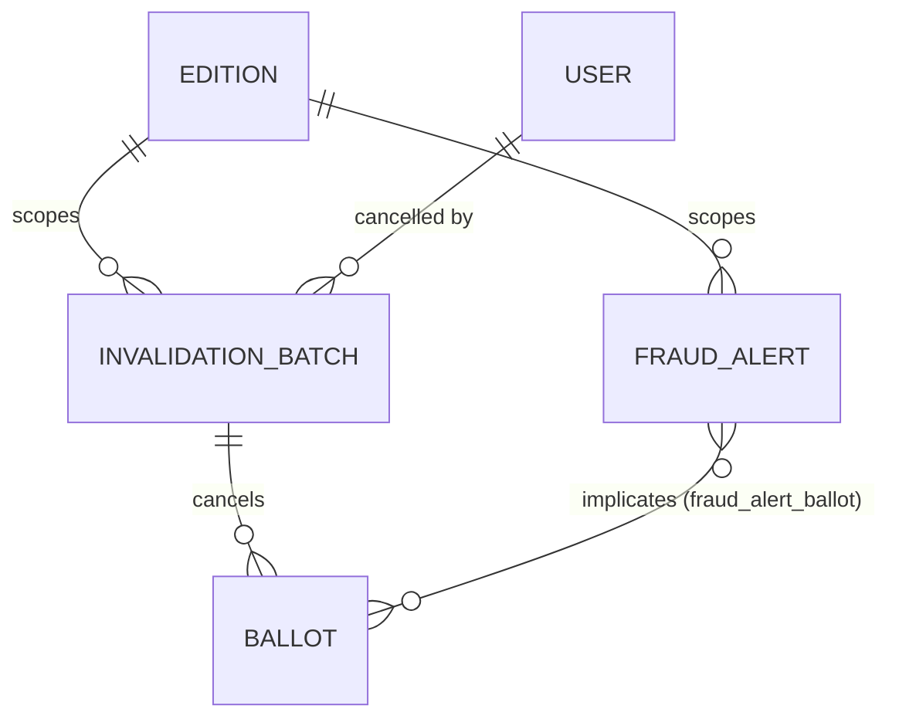

# Domain Model

Every **persistent entity** in `rominas-api`, grouped by module, with its key fields and the
relationships between entities. Models live at `app/Modules/<Module>/…/Model/`.

Only **implemented** modules are documented in full; planned modules are listed at the end so the
picture stays complete. Keep this file in sync whenever an entity is added or changed.

## Module overview

| Module | Entities | Kind |
| --- | --- | --- |
| [Access control](#access-control--users-roles-permissions) (`Users`, `Roles`, `Permissions`) | User, Role, Permission | Admin accounts & authorization |
| [Taxonomies](#taxonomies) | Taxonomy, TaxonomyTerm | Classification vocabulary |
| [Editions](#editions) | Edition | Yearly award edition + lifecycle |
| [Categories](#categories) | Category | Award categories, scoped to an edition |
| [Catalog](#catalog) | Artist, Band, Venue, Song, Album | Nominatable entities |
| [Academy](#academy) | Member, Nomination, NominationRanking, MemberProposal | Participant accounts, ranked nominations, member proposals |
| [Behavioural modules](#behavioural-modules-no-persistent-entities) (`Auth`, `Delivery`, `Shared`) | MagicLinkToken | Behaviour + the magic-link token store |

> **Catalog entities are standalone** — there are no relationships between Artist/Band/Venue/Song/
> Album (nor to Categories) yet. A category names the *type* of catalog entity it accepts via the
> `NomineeType` enum; the actual nominee↔category links arrive with the `Academy`/`Voting` modules.

---

## Access control — `Users`, `Roles`, `Permissions`

Admin accounts and authorization, built on [spatie/laravel-permission](https://spatie.be/docs/laravel-permission)
and Laravel Sanctum. `Role` and `Permission` extend the Spatie base models; `User` is the
authenticatable admin account. The full auth story (guards, tokens, the wildcard-permission scheme)
is in [access-control.md](access-control.md).

**User** — `app/Modules/Users/Model/User.php`

| Field | Notes |
| --- | --- |
| `name`, `email`, `password` | `password` is `hashed`; `email` unique |
| `email_verified_at` | nullable datetime |

Traits: `HasRoles`, `HasApiTokens` (Sanctum), `HasPermissionTargets`, `Notifiable`. `isSuperAdmin()`
checks the configured `super_admin_role`, which bypasses every gate via `Gate::before`
(`app/Providers/AuthServiceProvider.php`).

**Role** — `app/Modules/Roles/Model/Role.php` — Spatie role (`name`, `guard_name`). Seeded set:
`super_admin`, `admin`, `custodian`, `fraud_monitor` (`database/seeders/RoleSeeder.php`).
**Permission** — `app/Modules/Permissions/Model/Permission.php` — Spatie permission (`name`,
`guard_name`).

**Relationships**

- `User` ⇄ `Role` (many-to-many, pivot `model_has_roles`).
- `Role` ⇄ `Permission` (many-to-many, pivot `role_has_permissions`).
- `User` ⇄ `Permission` (direct, many-to-many, pivot `model_has_permissions`).

---

## Taxonomies

A reusable classification vocabulary. A **Taxonomy** (e.g. *Genre*, *Region*, *Tag*) owns a set of
**TaxonomyTerms**; terms may be hierarchical and carry SEO/visibility metadata. Ported from `door`.

> **Not yet attached to anything.** Catalog entities carry no taxonomy pivots in the current phase —
> genre/region tagging of artists/songs/venues will be added when the domain calls for it.

**Taxonomy** — `app/Modules/Taxonomies/Model/Taxonomy.php`

| Field | Notes |
| --- | --- |
| `name` | unique |
| `hierarchical` | bool — whether terms may nest |
| `allows_multiple` | bool — whether an associated model may hold one term or many |

**TaxonomyTerm** — `app/Modules/Taxonomies/Model/TaxonomyTerm.php`

| Field | Notes |
| --- | --- |
| `taxonomy_id` | FK → Taxonomy (`cascadeOnDelete`) |
| `parent_id` | nullable self-FK (`nullOnDelete`) |
| `name`, `slug` | unique **per taxonomy** (`(taxonomy_id, name)` / `(taxonomy_id, slug)`); slug auto-generated |
| `meta` | JSON, cast to a `TaxonomyTermMeta` value object (`seo`, `hidden`) |

**Relationships** — `Taxonomy` → many `TaxonomyTerm` (`terms()`); `TaxonomyTerm` → one `Taxonomy`
(`taxonomy()`), self-referencing `parent()` / `children()`.

---

## Editions

A yearly awards edition and its lifecycle. Only **one non-archived edition** may exist at a time.
The lifecycle state machine and the six-datetime timeline are documented in full in
[edition-lifecycle.md](edition-lifecycle.md).

**Edition** — `app/Modules/Editions/Model/Edition.php`

| Field | Notes |
| --- | --- |
| `name` | unique |
| `slug` | unique, auto-generated from `name` |
| `starts_at` | overall edition window start (mandatory) |
| `nominations_start_at` | academy nominations open (mandatory) |
| `nominations_end_at` | academy nominations close (mandatory) |
| `voting_start_at` | public voting opens (mandatory) |
| `voting_end_at` | public voting closes (mandatory) |
| `ends_at` | overall edition window end (mandatory) |
| `status` | `EditionStatus` enum, default `draft` |
| `academy_vote_weight` | result weight of the academy round, default `60` (read by `Scoring`) |
| `public_vote_weight` | result weight of public voting, default `40` (read by `Scoring`) |

All six datetimes are **strictly ordered**: `starts_at < nominations_start_at < nominations_end_at
< voting_start_at < voting_end_at < ends_at`, enforced by chained `after:` rules in
`Create`/`UpdateEditionRequest`.

**Enum** — `EditionStatus` (`Editions/Enums`): `draft` → `invitations_sent` → `nominations_open`
→ `nominations_closed` → `voting_open` → `voting_closed` → `committee_review` → `results_published`
→ `archived` (linear; `archived` is terminal). `isActive()` = not `archived`.

**Relationships** — `Edition` → many `Category` (via `Category::edition()`).

**Invariant** — at most one edition with `status != archived`, enforced in `CreateEditionAction`
(422 on a second active edition).

---

## Categories

Award categories (e.g. *Best Album*), scoped to an edition and **typed**: each declares which
catalog entity type it accepts.

**Category** — `app/Modules/Categories/Model/Category.php`

| Field | Notes |
| --- | --- |
| `edition_id` | FK → Edition (`cascadeOnDelete`) |
| `name`, `slug` | unique **per edition** (`(edition_id, name)` / `(edition_id, slug)`); slug auto-generated |
| `nominee_type` | `NomineeType` enum — the catalog entity type this category competes |
| `position` | int — display ordering |
| `description` | nullable |

**Enum** — `NomineeType` (`Catalog/Enums/NomineeType.php`): `artist` \| `band` \| `venue` \| `song`
\| `album`. Slug-backed (never the class FQN); `modelClass()` resolves the slug to its Eloquent
model (morph-map style) and `label()` gives a display name.

**Relationships** — `Category` → one `Edition` (`edition()`). The `nominee_type` links a category to
a catalog **model class** (not a row) via `NomineeType::modelClass()`.

**Rules** — `edition_id` is required on create and **immutable on update** (`CategoryDataFactory`
has separate `fromCreateRequest`/`fromUpdateRequest`); `nominee_type` validated with
`Rule::enum(NomineeType::class)`. Points-per-rank / scoring config is **not** on Category — it
belongs to the planned `Scoring` module.

---

## Catalog

The nominatable entities. Each is a **flat, standalone** per-entity submodule (`Catalog/Artist/…`,
`Catalog/Band/…`, …) with the same skeleton; there are **no relationships between them yet**
(no band membership, no song→album) and no taxonomy pivots.

Every entity shares the same shape:

| Field | Notes |
| --- | --- |
| `name` | required |
| `slug` | unique, auto-generated from `name` (`booted()` saving hook) |
| `description` | nullable |

**Entities** — `Artist`, `Band`, `Venue`, `Song`, `Album` (`app/Modules/Catalog/<Entity>/Model/`).
Tables: `artists`, `bands`, `venues`, `songs`, `albums`. Each has full CRUD under `/admin/<entity>s`,
a policy gating on the `<entity>s` permission, and a typed QueryBuilder (search/sort + permission
scoping). The `NomineeType` enum (see [Categories](#categories)) maps its slugs to these models.

> Type-specific scalar fields (e.g. Venue `city`, Album `release_year`) and inter-entity
> relationships are intentionally deferred — add them when a concrete requirement lands.

### NomineeSubmission (free-text reconciliation)

`app/Modules/Catalog/NomineeSubmission/` — the staging area that turns the free text academy members type
on the ballot into canonical Catalog entities. Because scoring and shortlisting tally by
`(nominee_type, nominee_id)`, spelling/case variants of one name must collapse to a single Catalog row, so
each typed name is deduplicated and reconciled once by an admin.

| Field | Notes |
| --- | --- |
| `edition_id` | FK → Edition (`cascadeOnDelete`) |
| `nominee_type` | `NomineeType` enum slug (the target Catalog type) |
| `raw_name` | the name as first typed |
| `normalized_name` | slug of `raw_name` — the dedup key |
| `status` | `NomineeSubmissionStatus` — `pending` \| `resolved` \| `rejected` |
| `resolved_nominee_id` | nullable Catalog row id once linked/created (morph type = `nominee_type`) |
| `reviewed_by_user_id` | nullable FK → users (`nullOnDelete`) |
| `reviewed_at` / `review_note` | nullable review metadata |

Unique `(edition_id, nominee_type, normalized_name)` — one row per distinct name per type per edition, which
also "remembers" a resolution for the rest of the edition (a later ballot typing the same name reuses the
resolved row and gets `nominee_id` immediately). `hasMany` NominationRanking; `resolvedNominee()` is a
`morphTo` on `(nominee_type, resolved_nominee_id)`. Reconciliation actions: `ResolveOrCreateNomineeSubmission`
(ballot-side dedup), `SuggestCatalogMatches` (ranked match candidates), `LinkNomineeSubmission` (→ existing
entity + backfill rankings), `CreateNomineeFromSubmission` (→ new entity), `RejectNomineeSubmission`. Admin
API and the shortlist interlock: [access-control.md §2k](access-control.md#2k-nominee-reconciliation-the-nomineesubmission-module).

#### How match suggestions are scored

`SuggestCatalogMatches` ranks existing Catalog rows of the submission's type so an admin can link with one
click. Scoring is **token-based and order-independent**, not a raw string comparison — human names routinely
arrive in either order ("Delia Matache" vs "Matache Delia") and with typos, and a naive `similar_text` over
the whole string is order-sensitive and over-credits incidental letter overlap (unrelated names would score
~48%, and a first/last-name swap could rank *below* them).

Each name is reduced to its word tokens (the slug's `-`-separated segments, via `NomineeNameNormalizer::tokens`).
The score in `[0, 100]` is a **soft Dice coefficient** over the two token sets: for every token, we take its
best per-token `similar_text` match in the other name, and a name's final score is the summed overlap divided
by the combined token count. An exact normalized match short-circuits to 100; candidates that score 0 are
dropped from the list entirely (rather than padding it with noise).

**`SuggestCatalogMatchesAction::TOKEN_MATCH_THRESHOLD` (`0.7`)** is the one tuning knob. It is the
"are these two words the same word?" cutoff, applied **per token pair, not per name**: a token's best match
only contributes to the overlap when its similarity is `≥ 0.7`; below that it contributes `0`. This is what
gives the scorer its clean behaviour — a dropped/swapped letter still matches (`matache` ≈ `matace` ≈ 0.92,
`delia` ≈ `dalia` ≈ 0.8), while genuinely different words (`aurelian` vs `matache` ≈ 0.4) count as no match,
so unrelated names collapse to 0 and disappear from suggestions instead of floating at a coincidental ~48%.

Tuning: **raise** it (e.g. `0.85`) for stricter matching — fewer false suggestions, but a heavier typo may
stop matching its real entry; **lower** it (e.g. `0.5`) to catch sloppier typos at the cost of letting
incidental overlap creep back onto the list. It only ever answers "same word or not?" for one token pair, so
it can be tuned in isolation against example pairs without affecting anything else.

---

## Academy

Academy-member accounts, their passwordless auth, and their **ranked nominations**. A **Member** is a
participant account on its own `member` Sanctum guard (never the admin `web` guard); members log in
via magic link. Admins manage the roster; invitations are emailed when an edition enters
`invitations_sent`. Members then rank nominees per category. Member proposals are handled here too;
the per-category voting **shortlist** — generated on demand by admins once nominations close — is a
sibling submodule ([Shortlist](#shortlist)).

**Member** — `app/Modules/Academy/Member/Model/Member.php`

| Field | Notes |
| --- | --- |
| `name` | required |
| `email` | unique |
| `status` | `MemberStatus` enum — `invited` \| `active` \| `suspended` |
| `email_verified_at` | nullable; set on first magic-link login |
| `invited_at` | nullable; set when an invitation is sent |
| `activated_at` | nullable; set on first successful login |

Authenticatable (`HasApiTokens`, `Notifiable`); **passwordless** (no password column). `#[UsePolicy(MemberPolicy)]`
gates admin-side CRUD on the `members` permission. `MemberQueryBuilder` adds search/sort +
`filterByStatus()`. A member becomes `active` on first magic-link verify; `suspended` members are
barred from logging in. Full auth story in [access-control.md](access-control.md).

**Nomination** — `app/Modules/Academy/Nomination/Model/Nomination.php` — a member's ballot for one
edition (one row per member+edition).

| Field | Notes |
| --- | --- |
| `member_id` | FK → Member (`cascadeOnDelete`) |
| `edition_id` | FK → Edition (`cascadeOnDelete`) |
| `status` | `NominationStatus` enum — `draft` \| `submitted` |
| `submitted_at` | nullable; set when finalized |

Unique `(member_id, edition_id)`. `belongsTo` Member/Edition, `hasMany` rankings.

**NominationRanking** — `app/Modules/Academy/Nomination/Model/NominationRanking.php` — one ranked pick.

| Field | Notes |
| --- | --- |
| `nomination_id` | FK → Nomination (`cascadeOnDelete`) |
| `category_id` | FK → Category (`cascadeOnDelete`) |
| `nominee_submission_id` | FK → NomineeSubmission (nullable, `cascadeOnDelete`) — the free-text pick this rank was typed as |
| `rank` | tinyint, 1 = top (order → points, later, in `Scoring`) |
| `nominee_type` | `NomineeType` enum slug — the polymorphic morph alias |
| `nominee_id` | the Catalog row id — **nullable**, backfilled when the submission is reconciled |

Unique `(nomination_id, category_id, rank)`, `(nomination_id, category_id, nominee_submission_id)` and
`(nomination_id, category_id, nominee_type, nominee_id)`. `nominee()` is a `morphTo` resolved via the
**morph map** (`AppServiceProvider`, mapping each `NomineeType` slug → its Catalog model, so nominee rows
store the slug not a FQN); it is null until reconciliation. Members **type nominee names (free text)** —
each name is staged as a [NomineeSubmission](#nomineesubmission-free-text-reconciliation) and the ranking
points at it, carrying `nominee_id` = null while pending. Gating (open window) and the submit rule (every
category has exactly 5) live in the Nomination actions — see the Academy nominations flow in
[access-control.md](access-control.md#2c-ranked-nominations-the-nomination-module).

**MemberProposal** — `app/Modules/Academy/MemberProposal/Model/MemberProposal.php` — a standing
proposal, made by a member, to add a future academy member. Not edition-scoped (a running pool).

| Field | Notes |
| --- | --- |
| `proposed_by_member_id` | FK → Member (`cascadeOnDelete`) — the proposer |
| `name`, `email` | the proposed person (required) |
| `position`, `company`, `phone` | nullable — the proposed person's contact/identity details (*functie* / *firma* / *nr. telefon*) |
| `reason` | nullable — the proposer's justification |
| `status` | `MemberProposalStatus` enum — `pending` \| `approved` \| `rejected` |
| `member_id` | nullable FK → Member — the invited Member created on approval |
| `reviewed_by_user_id` | nullable FK → User — the admin who reviewed |
| `reviewed_at`, `review_note` | nullable — review metadata |

Members submit/list/withdraw their own proposals (guard `member`, anytime), subject to a **per-member
lifetime cap** (`config('academy.max_proposals_per_member')`, default 5 — counts every proposal the
member has ever made, any status); admins review under the `memberProposals` permission — **approving
creates an invited Member** (reusing `CreateMemberAction`, from `name` + `email` only), feeding the
invitation flow. See [access-control.md](access-control.md#2d-member-proposals).

**MagicLinkToken** — `app/Modules/Auth/MagicLink/Model/MagicLinkToken.php` (guard-agnostic; see the
Behavioural modules note).

### Shortlist

The bridge from academy nominations to public voting. Once nominations close, admins **generate** each
category's shortlist — the top 5 nominees, by summed academy points — which becomes the frozen candidate
list the public ballot ranks. Generation is an **explicit, on-demand admin action** (not an automatic
side effect of the `nominations_closed` transition): per-category or bulk (all categories in the edition).
It may run — and re-run, replacing prior entries — only while the edition is `nominations_closed`; once
voting opens the shortlist is locked.

Points use the academy curve (client PHAZE 1), `points = 2 · (6 − rank)` (rank 1 → 10 pts, 2 → 8, 3 → 6,
4 → 4, 5 → 2), owned by `Rominas\Scoring\RankPoints::forRank()` (also used by the `Scoring` module). The
curve is a uniform 2× of the original 5/4/3/2/1, so it leaves the shortlist order untouched. Public ballots
use the separate, shorter `Rominas\Scoring\PublicRankPoints` curve.
Nominees are ordered points desc, ties broken by nominee id; genuine ties at the cutoff (and any other
manual edit) are settled by admins via the **review/adjust flow**: `GET …/candidates` returns the full
ranked candidate pool and `PUT …/shortlist` replaces a category's shortlist with the admin's final
ordered nominees (see [access-control.md](access-control.md#2e-nominee-shortlist)).

**ShortlistEntry** — `app/Modules/Academy/Shortlist/Model/ShortlistEntry.php` — one finalist on a
category's shortlist.

| Field | Notes |
| --- | --- |
| `edition_id` | FK → Edition (`cascadeOnDelete`) |
| `category_id` | FK → Category (`cascadeOnDelete`) |
| `nominee_type` | `NomineeType` enum slug — the polymorphic morph alias |
| `nominee_id` | the Catalog row id |
| `points` | nullable — summed academy points; on a manual adjust, re-derived (0 if the nominee had no academy nominations) |
| `position` | 1 = top of the shortlist |

Unique `(edition_id, category_id, nominee_type, nominee_id)` and `(edition_id, category_id, position)`.
`belongsTo` Edition/Category; `nominee()` is a `morphTo` resolved through the morph map. Generation lives
in `GenerateCategoryShortlistAction` (one category) and `GenerateEditionShortlistsAction` (bulk); the
admin endpoints and `shortlists` permission are in [access-control.md](access-control.md#2e-nominee-shortlist).

---

## Voting

Accountless public voting. A member of the public requests a one-time link by email, ranks the
shortlisted nominees, and votes once. There is **no account and no guard** — possession of the (hashed)
link token is the authorization, checked in application code. Personal data is pseudonymized: only HMAC
hashes of the email and IP are stored (never plaintext), keyed by a stable `voting.pepper`
(`config/voting.php`). Voting reads the [Shortlist](#shortlist) as the candidate set and stores ranks
only; points/weighting are a later `Scoring`/`Results` concern.

**Ballot** — `app/Modules/Voting/Model/Ballot.php` — one voter's ballot/identity/link for an edition.

| Field | Notes |
| --- | --- |
| `edition_id` | FK → Edition (`cascadeOnDelete`) |
| `email_hash` | HMAC-SHA256 of the normalized email — the pseudonymized identity (no plaintext) |
| `token_hash` | SHA-256 of the single-use link token (**unique**); the plaintext token only leaves by email |
| `status` | `BallotStatus` enum — `issued` \| `submitted` |
| `expires_at` | link expiry (set to the edition's `voting_end_at`) |
| `submitted_at` | nullable; set when the ballot is cast |
| `ip_hash` | nullable; HMAC of the submitter IP, captured at submit for `FraudMonitoring` |
| `invalidation_batch_id` | nullable FK → `InvalidationBatch` (`nullOnDelete`); **non-null = cancelled** (see [FraudMonitoring](#fraudmonitoring)) |

Unique `(edition_id, email_hash)` → **one link, ever, per email per edition**. `belongsTo` Edition +
`invalidationBatch`; `hasMany` rankings. `BallotQueryBuilder` adds `forEdition` / `byEmailHash` /
`byTokenHash` / `issued` / `submitted` / `valid` (not cancelled) / `invalidated`. A ballot counts toward
Scoring iff `invalidation_batch_id` is null.
`BallotStatus` is the lifecycle; `VoterHasher` (`Voting/Support/`) is the single pseudonymization helper.

**BallotRanking** — `app/Modules/Voting/Model/BallotRanking.php` — one ranked vote (mirrors
`NominationRanking`).

| Field | Notes |
| --- | --- |
| `ballot_id` | FK → Ballot (`cascadeOnDelete`) |
| `category_id` | FK → Category (`cascadeOnDelete`) |
| `rank` | 1 = favourite (order → points, later, in `Scoring`) |
| `nominee_type` | `NomineeType` enum slug — the polymorphic morph alias |
| `nominee_id` | the Catalog row id (must be on that category's shortlist) |

Unique `(ballot_id, category_id, rank)` and `(ballot_id, category_id, nominee_type, nominee_id)`.
`nominee()` is a `morphTo` via the app-wide morph map. Casting a ballot is a one-shot atomic submit
(`SubmitBallotAction`): each included category must rank **exactly 3** of its 5 shortlisted nominees in
order of preference (client PHAZE 4; fewer only if the shortlist itself holds fewer than 3), and ≥1
category is required. Public points use the `Rominas\Scoring\PublicRankPoints` curve (rank 1 → 10, 2 → 8,
3 → 6). The ballot presents nominees **alphabetically** so the secret academy shortlist order never leaks.
The endpoints and the accountless flow are in [access-control.md](access-control.md#2f-public-voting).

---

## Results

The custodian-gated, persistent face of the [Scoring](#behavioural-modules-no-persistent-entities)
engine: while Scoring only ever computes on demand, `Results` (`app/Modules/Results/`) lets the
**custodian** view/export an edition's complete results during the review window, and freezes an
**immutable snapshot** into the database the moment the edition is published. Read path is unified — a
published edition is served from its frozen snapshot, an unpublished one is computed live — so the same
JSON shape (a Scoring `EditionScore`, enriched with category/nominee names by `EditionResultsPresenter`)
covers both. The snapshot is what becomes **public** at publish time. Access rules are in
[access-control.md](access-control.md#2g-results).

**ResultSnapshot** — `app/Modules/Results/Model/ResultSnapshot.php` — one frozen result set per edition.

| Field | Notes |
| --- | --- |
| `edition_id` | FK → Edition (`cascadeOnDelete`), **unique** — one snapshot per edition |
| `academy_vote_weight` | the academy weight in force at publish (captured so the snapshot is self-describing) |
| `public_vote_weight` | the public weight in force at publish |
| `published_at` | when the snapshot was frozen |

`belongsTo` Edition; `hasMany` entries. `ResultSnapshotQueryBuilder` adds `forEdition` +
`visibleToUser` / `actionableByUser` (the `results` permission). Written only by
`PublishEditionResultsAction` (idempotent: an existing snapshot is replaced, entries cascade away).

**ResultEntry** — `app/Modules/Results/Model/ResultEntry.php` — one nominee's frozen standing (mirrors
Scoring's `NomineeScore` DTO).

| Field | Notes |
| --- | --- |
| `result_snapshot_id` | FK → ResultSnapshot (`cascadeOnDelete`) |
| `category_id` | FK → Category (`cascadeOnDelete`) |
| `nominee_type` | `NomineeType` enum slug — the polymorphic morph alias |
| `nominee_id` | the Catalog row id |
| `academy_points` / `public_points` | raw summed points on each side |
| `academy_share` / `public_share` / `final_score` | normalized shares and the weighted score (0..1, display-rounded) |
| `position` | 1 = winner |

Unique `(result_snapshot_id, category_id, nominee_type, nominee_id)` and
`(result_snapshot_id, category_id, position)`. `nominee()` is a `morphTo` via the app-wide morph map.
The snapshot is frozen by the `FreezeResultsOnEditionPublished` listener on the `EditionTransitioned`
event (→ `results_published`); see [edition-lifecycle.md](edition-lifecycle.md).

---

## FraudMonitoring

`FraudMonitoring` (`app/Modules/FraudMonitoring/`) gives a **fraud monitor** or **custodian** two things:
a **reactive** side — review an edition's public ballots and cancel fraudulent votes — and a
**proactive** side — a scheduled sweep that flags suspicious clusters as reviewable alerts. Both are
gated by the single `fraudMonitoring` permission. Endpoints/authorization: [access-control.md](access-control.md#2h-fraud-monitoring).

**Reactive — vote cancellation.** Cancellation is done in **batches**, each carrying a single mandatory
reason and the acting admin — the batch is the audit unit. Cancelled ballots point back at their batch
and stop counting toward [Scoring](#behavioural-modules-no-persistent-entities). **Invalidation is
terminal** (no reversal); the nullable FK leaves room to add one later.

**Proactive — fraud alerts.** A scheduled command (`fraud:detect`, hourly) runs pluggable detectors over
the edition's submitted, still-valid ballots and records a `FraudAlert` per suspicious cluster. Detectors
(`FraudMonitoring/Detectors/`): **SharedIp** (N+ ballots sharing one `ip_hash`), **VelocityBurst** (a
submission spike inside a fixed time window), **IdenticalRanking** (N+ ballots with a byte-identical
ordered vote set — a bot fingerprint). The enabled set and thresholds live in `config/fraud.php`
(`enabled_detectors` is injected into `DetectVotingFraudAction` by `AppServiceProvider` — remove one to
disable it). New composite indexes `(edition_id, ip_hash)` and `(edition_id, submitted_at)` on `ballots`
support the sweep.

**InvalidationBatch** — `app/Modules/FraudMonitoring/Model/InvalidationBatch.php` — one vote-cancellation
event.

| Field | Notes |
| --- | --- |
| `edition_id` | FK → Edition (`cascadeOnDelete`) |
| `reason` | mandatory; the shared reason for every ballot in the batch |
| `invalidated_by` | nullable FK → User (`nullOnDelete`) — the admin who cancelled; kept for audit even if the user is removed |
| `created_at` | when the cancellation happened |

`belongsTo` Edition + `invalidatedBy` (User); `hasMany` ballots. `InvalidationBatchQueryBuilder` adds
`forEdition` + `visibleToUser` / `actionableByUser` (the `fraudMonitoring` permission). Written by
`InvalidateBallotsAction`, which only affects the edition's **submitted, not-already-invalidated**
ballots among the requested ids (idempotent), sets each one's `invalidation_batch_id`, and busts the
edition's cached Scoring output.

**FraudAlert** — `app/Modules/FraudMonitoring/Model/FraudAlert.php` — one recorded suspicious cluster.

| Field | Notes |
| --- | --- |
| `edition_id` | FK → Edition (`cascadeOnDelete`) |
| `type` | `FraudAlertType` — `shared_ip` \| `velocity_burst` \| `identical_ranking` |
| `signature` | stable dedupe key for the cluster (the ip_hash, the window start, or the ranking hash) |
| `severity` | `FraudAlertSeverity` — `low` \| `medium` \| `high` (from the count-vs-threshold ratio) |
| `status` | `FraudAlertStatus` — `pending` (default) \| `solved` \| `dismissed` (set by a monitor) |
| `context` | JSON — hashes/counts only, **no plaintext PII** |
| `ballot_count` | implicated-ballot count at last detection |
| `first_detected_at` / `last_detected_at` | detection timeline |

`(edition_id, type, signature)` is indexed (not unique) — dedupe is **per active alert**. `belongsTo`
Edition; `belongsToMany` Ballot via the `fraud_alert_ballot` pivot (`ballots()`). `FraudAlertQueryBuilder`
adds `forEdition` + `visibleToUser` / `actionableByUser`. Written by `DetectVotingFraudAction` (invoked by
the `fraud:detect` command): each detector's candidate reuses the signature's existing **non-`solved`**
alert (a `pending` one, or a `dismissed` false positive kept suppressed) — refreshing its facts and
re-`sync()`ing the pivot but **never** its `status` — and otherwise creates a new `pending` alert. So a
signature that re-offends after being `solved` (its ballots invalidated → excluded by `->valid()`) raises
a **new** alert, and `solved` rows accumulate as per-episode history. `UpdateFraudAlertStatusAction` sets the status from the admin endpoint;
it does not itself invalidate ballots (that stays the explicit `InvalidateBallotsAction`).

---

## Audit (cross-cutting trail)

`app/Modules/Audit/` — a single append-only `AuditLog` recording **who did what**: admin actions, plus
authentication and account-lifecycle events (admin login/logout, member magic-link request/verify, member
logout, member proposal withdrawal). Public participation is otherwise self-recording (a ballot carries its
own state; a nomination its own). One terminable middleware — `RecordAuditTrail` — is the sole writer,
attached both to the `/admin` group and to the audited auth/account routes.

**AuditLog** — `app/Modules/Audit/Model/AuditLog.php` — one audited request.

| Field | Notes |
| --- | --- |
| `causer_type` / `causer_id` | the actor, polymorphic and decoupled — a stable alias (`user` \| `member` \| null) + the model key. Null for an unauthenticated attempt (a failed login, a magic-link request). No FK — the trail outlives the actor |
| `causer_label` | the actor's name, snapshotted so the row stays legible after the actor is deleted |
| `action` | the matched **route name** (e.g. `api.admin.editions.transition`, `api.authenticate`) — semantic, no enum |
| `method` | HTTP verb |
| `subject_type` / `subject_id` | the route's most specific model binding — its parameter name (`edition`, `proposal`) + key; null for a top-level create or a login |
| `status_code` | the response status — so denied (403), validation (422) and error (500) outcomes are recorded too |
| `context` | JSON — the redacted request payload plus any `Context`-supplied extras; **no credentials/tokens, no plaintext PII** (emails redacted, or hashed on auth routes — see below) |
| `ip_address` | plaintext admin/actor IP (the §6 GDPR exception — kept for forensic accountability, not hashed like voter IPs) |
| `user_agent` | the request user agent |

`AuditLogQueryBuilder` adds `forCauser` (type + id) / `forAction` / `forSubject` / `betweenDates` +
`visibleToUser` / `actionableByUser` (the `audit` permission). **Append-only** — no create/update/delete
endpoints; rows are written only by the middleware.

**How it records** (`RecordAuditTrail::terminate`): logs after the response is sent (no added latency) off
the final rendered response. Two coverage rules (config/audit.php):

- **Opt-out for `/admin`** — every state-changing request (`POST/PUT/PATCH/DELETE`) is logged unless its
  route name is in `ignore`; reads only when listed in `audited_reads` (viewing/exporting final results).
- **Opt-in elsewhere** — only route names in `audited` are logged (the auth + account-lifecycle events).

**Actor resolution** is polymorphic: the authenticated model (admin `User` or academy `Member`, mapped to
its alias by `causer_types`), or — for a login, where no actor is authenticated during the request — the id
recovered from the success response body via `actor_from_response` (`userId` / `memberId`). Unauthenticated
attempts have no actor.

**PII**: payload keys are redacted by the glob patterns in `redact` (credentials, tokens, emails). On the
auth routes in `hash_emails_on`, the attempted email is instead stored as a non-reversible HMAC
`email_hash` (`Audit\Support\AuditHasher`, keyed by `audit.pepper`) so an otherwise anonymous login attempt
stays correlatable without plaintext PII (GDPR §6) — mirroring the Voting module's `VoterHasher`.

An Action can enrich its entry without any dependency by pushing data into Laravel's request `Context` under
the `audit` key (`Context::add('audit', ['changes' => …])`) — merged into `context`; this is the path to
richer old→new diffs later, with no middleware change. `InvalidationBatch` / `FraudAlert` remain the domain
source of truth for cancellations and alerts — the audit log **complements** them with a lightweight
pointer entry rather than re-storing their detail.

---

## Behavioural modules (no persistent entities)

- **`Auth`** (`app/Modules/Auth/`) — admin username/password login → Sanctum token
  (`POST /api/authenticate`), and logout (see [access-control.md](access-control.md)). Also hosts the
  **guard-agnostic magic-link primitive** (`Auth/MagicLink/`): the `MagicLinkToken` model (table
  `magic_link_tokens`, composite PK `(email, guard)`, hashed single-use token, 15-min TTL, 60s resend
  cooldown) plus `SendMagicLinkAction`/`VerifyMagicLinkAction` (resolve the account through the
  guard's own auth provider, so any participant guard reuses them) and a queued `SendMagicLinkJob`.
- **`Delivery`** (`app/Modules/Delivery/`) — transactional email behind a transport seam
  (SMTP active; Brevo ported as an opt-in alternative). An `action → PayloadFactory → service`
  pipeline driven by `config/delivery.php`; no stored models.
- **`Shared`** (`app/Modules/Shared/Concerns/`) — cross-module query-builder concerns
  (`QueryBuilderSearchableTrait`, `QueryBuilderSortableTrait`).
- **`Scoring`** (`app/Modules/Scoring/`) — the results engine; **computes on demand, persists nothing**
  (the future `Results` module owns the custodian-gated view/export and the publish-time snapshot). Per
  category it re-tallies each shortlisted nominee's academy points (submitted `NominationRanking`s, via the
  `RankPoints` curve) and public points (submitted, **non-cancelled** `BallotRanking`s — `->valid()`,
  excluding any ballot cancelled by `FraudMonitoring` — via the `PublicRankPoints` curve), then hands them
  to the configured **`ScoringAlgorithm`** (a `ScoringAlgorithm` interface, selected by
  `config('scoring.algorithm')`, re-read per resolve):
  - **`attributed`** (default — client PHAZE 3–7): maps each class's ranking to a fixed rank→score ladder
    (academy by shortlist position → 200/150/100/75/50; public by public-points rank → 150/100/75/50/25,
    academy-first tiebreak) and **adds** the two attributed scores. Highest total wins, ties broken by the
    higher academy attributed score. The per-edition weights are baked into the ladders and ignored.
  - **`share`** (`ScoreCalculator`): **normalizes each class to its share** of that class's category total
    (so the two scales — dozens of academy members vs. thousands of voters — become comparable), then
    weights by the **edition's own** `academy_vote_weight` / `public_vote_weight` (default 60 / 40):
    `finalScore = 0.6·academyShare + 0.4·publicShare` (0..1). Ranking uses an **exact integer key**
    (`wₐ·aᵢ·P + wₚ·pᵢ·A`) — never floats — ties broken academy → public → nominee id; a category with no
    public votes renormalizes to academy 100%.

  Both are pure and DB-free and return the same `NomineeScore` DTO (whose `academyShare` / `publicShare` /
  `finalScore` fields carry 0..1 shares under `share`, or the discrete attributed scores + total under
  `attributed`). `ComputeCategoryScoresAction` / `ComputeEditionScoresAction` wire the DB and cache per
  edition + status (inputs are frozen from `voting_closed` onward). Weights live on the edition; the
  algorithm choice and ladders live in `config/scoring.php`. Guarded to `voting_closed` / `committee_review`
  / `results_published`.
- **`Reporting`** (`app/Modules/Reporting/`) — general management statistics, **kept separate from
  final `Results`**; **read-only aggregation, persists nothing** (no table, no model). Its foundation is
  the `ReportInterface` (`Reports/`): every report exposes `key()` / `title()` / `columns()` and a
  `rows(ReportParameters)` generator, format-agnostically. A `ReportRegistry` (`Support/`) indexes the
  reports listed in `config/reporting.php` by key; a `SpreadsheetReportExporter` (`Exporters/`) streams
  any report's `columns()`/`rows()` as CSV **or** Excel via **openspout** (one code path, low memory).
  The same shape backs the tabular JSON (`ReportResource`). Every vote report honours an optional
  `from`/`to` window (`ReportParameters`); per-entity reports resolve category + entity display names in
  batched, N+1-free passes via `Support/EntityLabeler` (`NomineeType::modelClass()`). Reports:
  - **`VotesPerCategoryPerDayReport`** (`votes-per-category-per-day`) — distinct submitted, **non-cancelled**
    ballots per category per UTC day (`COUNT(DISTINCT ballot_id)` grouped by category + `DATE(submitted_at)`).
  - **`NominationsPerEntityReport`** (`nominations-per-entity`) — count of submitted academy nomination
    picks per (category, entity). (The client's "nominations" and "academy votes" are one metric.)
  - **`PublicVotesPerEntityReport`** (`public-votes-per-entity`) — **rank-weighted** public points per
    (category, entity) via the `PublicRankPoints` curve (summed in PHP over per-rank counts, single-sourced),
    submitted + `->valid()` only. A plain count is less telling (the public ranks its 3 picks).
  - **`CancelledVotesPerDayReport`** (`cancelled-votes-per-day`) — invalidated ballots per UTC day.
  The **final ranking** ("clasament final") is served by the existing `Results` module, not duplicated
  here. Endpoints in [access-control.md](access-control.md); `reporting` permission (admin).

---

## Planned modules (not yet implemented)

Tracked in the ecosystem [`CLAUDE.md`](../../CLAUDE.md); each gets its own section here once built.

| Module | Planned entities / concern |
| --- | --- |
| `CriticsChoice` | `Critic` (separate authenticatable + guard), committee submissions |
