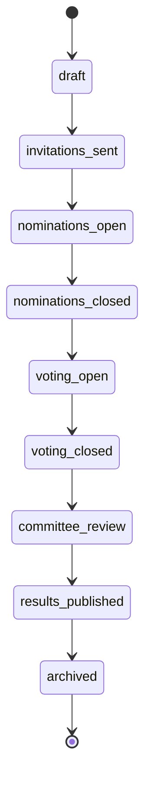

# Edition lifecycle

An **edition** is one yearly Rominas awards cycle. It owns a nine-state lifecycle and a six-point
timeline, and at most one edition is ever live. For where `Edition` sits in the schema see
[domain-model.md](domain-model.md#editions).

Everything here lives in `app/Modules/Editions/`.

## 1. The status machine

`EditionStatus` (`Editions/Enums/EditionStatus.php`) is a string-backed enum. Transitions are
**linear**; `archived` is terminal.



The enum owns the rules:

- `allowedTransitions(): list<self>` — the next status(es) reachable from the current one.
- `canTransitionTo(self $target): bool` — whether a move is legal.
- `isActive(): bool` — `true` for everything except `archived`.
- `label(): string` — a human label.

## 2. Changing status

`PATCH /api/admin/editions/{edition}/status` (`can:update,edition`) with `{ "status": "<target>" }`.

`TransitionEditionRequest` validates the target with `Rule::enum(EditionStatus::class)`, then
`TransitionEditionAction` checks `$edition->status->canTransitionTo($target)` — an illegal move
throws a `ValidationException` (**422**). On success it sets and saves the new status.

> **Transitions now emit an event.** `TransitionEditionAction` fires `EditionTransitioned`
> (`Editions/Events/`) after saving; cross-module listeners hang off it (wired in `EventServiceProvider`).
> The first is **live**: entering `invitations_sent` sends academy magic-link invitations
> (`Academy\Listeners\SendAcademyInvitationsOnEditionTransitioned`, see
> [access-control.md](access-control.md)). Entering `results_published` **freezes the results snapshot**
> (`Results\Listeners\FreezeResultsOnEditionPublished` → `PublishEditionResultsAction`; see
> [Results](domain-model.md#results)). There is no separate `committee_review` lock hook: Scoring's inputs
> are already frozen from `voting_closed` (submitted rankings/ballots are terminal), so the custodian
> review window is simply the scorable states — the results view is live-computed until publication, then
> served from the frozen snapshot.
>
> **Not** on this event (both gate on edition state directly, not via a listener): the per-category
> nominee **shortlist** is generated by an explicit admin action while the edition is
> `nominations_closed`. Because members nominate by **free text**, the window between `nominations_closed`
> and shortlist generation is when admins **reconcile** the typed names into canonical Catalog entities
> (the `NomineeSubmission` queue); shortlist generation is refused while any submission for the edition is
> still `pending`, so no typed nominee is silently dropped from the tally. And **public voting** is open
> while the edition is `voting_open` and now is within
> `[voting_start_at, voting_end_at]` (`Voting\ResolveOpenVotingEditionAction`). See the
> [Shortlist](domain-model.md#shortlist) / [Voting](domain-model.md#voting) domain notes and
> [access-control.md](access-control.md#2e-nominee-shortlist).
>
> Likewise **results scoring** (`Scoring` module) gates on edition state directly: it is computed on
> demand once the edition reaches `voting_closed` and stays available through `committee_review` and
> `results_published`. The inputs are frozen from `voting_closed` onward, so the computation is cached
> per edition + status. See the [Scoring](domain-model.md#behavioural-modules-no-persistent-entities)
> domain note.
>
> The **one deliberate exception** to "inputs frozen from `voting_closed`" is **vote cancellation**
> (`FraudMonitoring`, see [access-control.md](access-control.md#2h-fraud-monitoring)): a fraud monitor or
> custodian may cancel fraudulent ballots during the review window, before the `results_published` freeze.
> Cancelling excludes those ballots from the public tally (`->valid()`) and busts the edition's cached
> Scoring output, so the live results view reflects it immediately; the snapshot frozen at publish
> captures the post-cancellation result.

## 3. The timeline (six datetimes, strictly ordered)

An edition carries six **mandatory** datetimes that must satisfy a strict chain:

```
starts_at  <  nominations_start_at  <  nominations_end_at  <  voting_start_at  <  voting_end_at  <  ends_at
```

| Field | Meaning |
| --- | --- |
| `starts_at` | overall edition window opens |
| `nominations_start_at` | academy nominations open |
| `nominations_end_at` | academy nominations close (the nomination deadline) |
| `voting_start_at` | public voting opens |
| `voting_end_at` | public voting closes |
| `ends_at` | overall edition window closes |

The ordering is enforced in `Create`/`UpdateEditionRequest` by chaining Laravel's `after:` rule
(which is **strict**, `>`) so each field must be strictly after the previous:

```php
'starts_at'            => 'required|date',
'nominations_start_at' => 'required|date|after:starts_at',
'nominations_end_at'   => 'required|date|after:nominations_start_at',
'voting_start_at'      => 'required|date|after:nominations_end_at',
'voting_end_at'        => 'required|date|after:voting_start_at',
'ends_at'              => 'required|date|after:voting_end_at',
```

Because the rule is strict, **no two adjacent boundaries may be equal** — there must be a gap (even a
second) between, say, nominations closing and voting opening. The `status` machine (§1) and this
timeline are currently **independent**: transitions are not auto-gated on the clock. Time-based
gating (e.g. refusing `voting_open` before `voting_start_at`) is a natural future guard.

## 4. One active edition

At most one edition may be **non-archived** at a time (ecosystem CLAUDE.md §5). `CreateEditionAction`
enforces it: if `Edition::query()->active()->exists()` (any status other than `archived`), creating
another is rejected with a `ValidationException` (**422**). To start a new edition, archive the
previous one first.

`EditionQueryBuilder::active()` is the single source of that predicate (`status != archived`).

## 5. CRUD rules

- **Create** → always starts in `draft` (`CreateEditionAction`), subject to the one-active invariant.
- **Update** (`PATCH /api/admin/editions/{edition}`) → edits `name` + the six datetimes (re-validated
  against the strict chain), and optionally `academy_vote_weight` / `public_vote_weight` (omit to keep
  the current values; they may not both be zero). Status is **not** changed here — use the status
  endpoint (§2).
- **Delete** → only while `draft` (`DeleteEditionAction` throws 422 otherwise); anything already
  underway is `archived`, never deleted.

## 6. Files

| Concern | File |
| --- | --- |
| Status enum + transition map | `Editions/Enums/EditionStatus.php` |
| Model (casts, slug hook) | `Editions/Model/Edition.php` |
| One-active invariant | `Editions/Actions/CreateEditionAction.php` |
| Guarded transition | `Editions/Actions/TransitionEditionAction.php` |
| Draft-only delete | `Editions/Actions/DeleteEditionAction.php` |
| Timeline validation | `Editions/Requests/{Create,Update}EditionRequest.php` |
| Active predicate | `Editions/QueryBuilders/EditionQueryBuilder.php` |
| Routes | `routes/api/admin/editions.php` |
