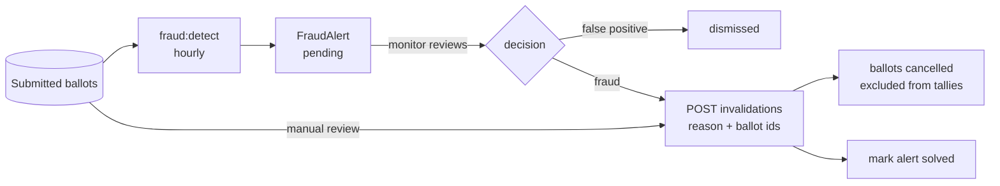

# Fraud monitoring

Protecting the public vote. The module has two sides:

- **Reactive**: a monitor reviews the edition's public ballots and **cancels** fraudulent ones, in batches
  that always carry a reason.
- **Proactive**: a scheduled sweep runs detectors over the ballots and raises **alerts** for suspicious
  clusters, which the monitor then triages.

Everything here lives in `app/Modules/FraudMonitoring/`, settings in `config/fraud.php`. Entity fields
(`InvalidationBatch`, `FraudAlert`) are in [domain-model.md](domain-model.md#fraudmonitoring); endpoints
are in [access-control.md §2h](access-control.md#2h-fraud-monitoring-the-fraudmonitoring-module). This is
the application layer; Cloudflare custom rules are the network layer and are configured outside this repo.



## 1. Who can do it

A single permission, **`fraudMonitoring`**, covers everything here. It is held by the **`fraud_monitor`**
and **`custodian`** roles and **deliberately not by `admin`**; `super_admin` bypasses. It is enforced by
`InvalidationBatchPolicy` and `FraudAlertPolicy`, checked against the class because the routes bind an
`Edition`.

## 2. Reviewing ballots

`GET /api/admin/editions/{edition}/ballots` (`ListMonitoredBallotsAction`) lists the edition's **submitted**
ballots, newest first, paginated. Each row shows:

- `email_hash` and `ip_hash`: hashes only, never plaintext (see [voting.md](voting.md#5-personal-data-gdpr));
- `ip_hash_shared_count`: how many submitted ballots in the **whole edition** share this IP hash (computed
  across the edition, not just the current page);
- `invalidated`, `invalidation_batch_id` and `invalidation_reason`, if the ballot is already cancelled.

## 3. Cancelling votes

`POST /api/admin/editions/{edition}/invalidations`:

```json
{ "reason": "Scripted submissions from one IP, see alert #14", "ballot_ids": [101, 102, 103] }
```

`reason` is **required** (3–1000 characters). `InvalidateBallotsAction`, in one transaction:

1. filters the requested ids down to the edition's **submitted, not already cancelled** ballots. Other ids
   are silently skipped, so re-sending the same request is harmless. If **none** are eligible, the request
   is a 422;
2. creates one `InvalidationBatch` with the reason and the acting user (`invalidated_by`);
3. sets `invalidation_batch_id` on each eligible ballot.

It then **clears the edition's cached Scoring results**, so live results reflect the cancellation
immediately. The response is the batch (201) with its ballot count.

Key properties:

- **The batch is the audit unit.** One reason and one actor per batch; list them with
  `GET …/invalidations` and inspect one with `GET …/invalidations/{invalidationBatch}`. The request itself
  is also recorded in the [audit trail](audit.md), because it is an admin write.
- **Cancellation is terminal.** There is no endpoint to restore a ballot. The FK is nullable, which leaves
  room for one later.
- **Nothing is deleted.** A cancelled ballot keeps its rankings. The `Ballot::valid()` scope
  (`invalidation_batch_id IS NULL`) is what removes it from Scoring, the detectors and the vote reports.
- **Timing.** There is no status guard, so cancelling works in any status. Before publication it changes
  live results. **After `results_published`, it does not change the frozen snapshot** (see
  [scoring-results.md](scoring-results.md#6-publishing-and-the-snapshot)), so cancel before publishing.

## 4. Automatic detection

The **`fraud:detect`** command is scheduled **hourly** in `routes/console.php`. It only runs if the server's
cron calls `php artisan schedule:run`. By default it scans every edition in `voting_open`, `voting_closed`
or `committee_review`; `--edition=<id>` restricts it to one edition. It can also be run by hand.

`DetectVotingFraudAction` runs each detector listed in `config('fraud.enabled_detectors')` (injected via
`AppServiceProvider`; remove a class to disable it). Every detector looks only at **submitted, still-valid**
ballots, so ballots that have already been cancelled stop triggering alerts.

| Detector | Flags | Signature | Threshold (env) |
| --- | --- | --- | --- |
| `SharedIpDetector` | ≥ N ballots with the same `ip_hash`, typically many emails voting from one IP | the `ip_hash` | 5 (`FRAUD_SHARED_IP_THRESHOLD`) |
| `VelocityBurstDetector` | ≥ N ballots submitted inside one fixed time window, i.e. an automated flood | window start (ISO-8601) | 50 per 10 min (`FRAUD_VELOCITY_THRESHOLD`, `FRAUD_VELOCITY_WINDOW_MINUTES`) |
| `IdenticalRankingDetector` | ≥ N ballots with a byte-identical ordered vote set across all categories, a bot fingerprint | SHA-256 of the ordered rankings | 3 (`FRAUD_IDENTICAL_RANKING_THRESHOLD`) |

Velocity windows are aligned to the Unix epoch, so a burst keeps the same signature from one run to the
next.

**Severity** measures how far the cluster exceeds the threshold: **≥ 3×** → `high`, **≥ 2×** → `medium`,
otherwise `low`.

An alert's `context` contains only hashes, counts and window bounds, never personal data. The implicated
ballots are linked through the `fraud_alert_ballot` pivot.

## 5. Alert triage and deduplication

`FraudAlertStatus` is `pending` (new), `solved` or `dismissed`, and it is set **only by a human**:
`PATCH /api/admin/editions/{edition}/fraud-alerts/{fraudAlert} {status}`.

On each run, a finding is matched to an existing alert with the same **(edition, type, signature)** whose
status is **not `solved`**:

- **Match found** (`pending`, or a `dismissed` false positive): the alert's facts are refreshed (severity,
  context, `ballot_count`, `last_detected_at`, ballot list), but **its status is never changed**. A
  dismissed false positive stays dismissed while it keeps matching.
- **No match**: a new `pending` alert is created. So a cluster that **comes back after being solved**
  appears as a new alert, and solved alerts build up as a history of separate incidents.

Marking an alert `solved` does **not** cancel anything. The intended flow is: open the alert
(`GET …/fraud-alerts/{fraudAlert}` lists its ballots), cancel those ballots with a reason (§3), then mark it
solved. `GET …/fraud-alerts` lists the edition's alerts, most recent activity first.

## 6. Files

| Concern | Where |
| --- | --- |
| Ballot review | `Actions/ListMonitoredBallotsAction.php`, `Resources/MonitoredBallotResource.php` |
| Cancellation | `Actions/InvalidateBallotsAction.php`, `Requests/InvalidateBallotsRequest.php` |
| Detection | `Commands/DetectVotingFraudCommand.php`, `Actions/DetectVotingFraudAction.php`, `Detectors/` |
| Triage | `Actions/UpdateFraudAlertStatusAction.php`, `Controllers/FraudAlertsController.php` |
| Config | `config/fraud.php`; schedule in `routes/console.php` |
| Routes | `routes/api/admin/fraud-monitoring.php` |
