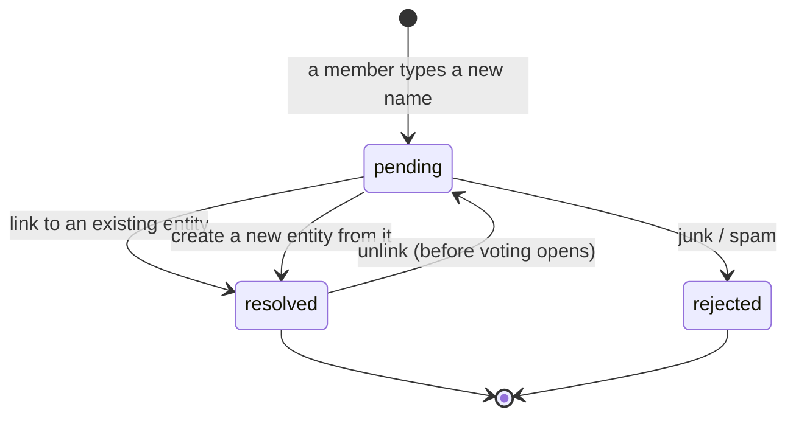

# Nominee reconciliation

Academy members nominate by **typing names**, not by picking from a list. But the shortlist and scoring
count points per Catalog entity — `(nominee_type, nominee_id)` — so every spelling of the same act must end
up on **one** Catalog row. Reconciliation is the admin step in between: each distinct typed name becomes a
`NomineeSubmission`, and an admin links it to an existing entity, creates a new one from it, or rejects it.

Everything here lives in `app/Modules/Catalog/NomineeSubmission/`. The fields are in
[domain-model.md](domain-model.md#nomineesubmission-free-text-reconciliation); the endpoints and permission
are in [access-control.md §2k](access-control.md#2k-nominee-reconciliation-the-nomineesubmission-module).
How names get typed in the first place is in [academy.md](academy.md#4-ranked-nominations).



Only `pending` submissions can be linked, created from or rejected. `rejected` is final; a `resolved`
submission can be **unlinked** back to `pending` until voting opens (§3).

## 1. Capture and deduplication

When a member saves a category, `ResolveOrCreateNomineeSubmissionAction` maps each typed name to a
submission keyed by **`(edition, nominee type, normalized name)`** (a unique index):

- **Normalization** — `NomineeNameNormalizer::normalize()` is `Str::slug()`: it lowercases, trims,
  collapses whitespace and strips punctuation. "Taylor Swift", "taylor swift" and " Taylor  Swift! " are
  one key.
- **Existing key** — the existing row is reused, whatever its status. Ten members typing the same name
  produce **one** item to reconcile.
- **New key** — a new `pending` row is created, keeping the first spelling as `raw_name`.

The ranking stores the submission id and copies its `resolved_nominee_id` into `nominee_id`. So a name an
admin already reconciled is **remembered** for the rest of the edition: a later ballot typing it gets
`nominee_id` straight away, and nothing new appears in the queue.

Deduplication is per edition and per type: the same name typed in an artist category and a band category
gives two submissions.

## 2. The admin queue

`GET /api/admin/editions/{edition}/nominee-submissions` lists the edition's submissions (paginated,
searchable, sortable), filterable by `?status=pending|resolved|rejected` and `?type=artist|band|…`. Each row
carries `ranking_count`, the number of ballot picks behind it, which is a useful priority signal.

`GET …/{nomineeSubmission}?with_suggestions=1` adds up to five ranked Catalog matches to help the admin link
in one click (§4).

All endpoints require the `nomineeSubmissions` permission (held by `admin`) and return 404 for a submission
belonging to another edition.

## 3. The decisions

### Link — `POST …/{nomineeSubmission}/link {nominee_id, note?}`

`LinkNomineeSubmissionAction`:

1. checks that `nominee_id` exists in the submission's Catalog type;
2. refuses (422) if linking would put the **same nominee twice in one member's category**. This happens
   when two different typed names turn out to be the same act and one is already linked. The admin must
   resolve the conflict, typically by rejecting one of the two;
3. in one transaction, marks the submission `resolved` (with reviewer, time and note) and **backfills
   `nominee_id` on every ranking** that points at it.

### Create — `POST …/{nomineeSubmission}/create {name?, note?}`

`CreateNomineeFromSubmissionAction` creates a **new** Catalog entity of the submission's type, named after
the typed name or an admin-corrected `name`, then links to it exactly as above, all in one transaction. It
refuses if an entity with the same slug already exists: the admin should link to that one instead of
creating a duplicate.

### Reject — `POST …/{nomineeSubmission}/reject {note?}`

`RejectNomineeSubmissionAction` marks the submission `rejected`. The Catalog is untouched, and the rankings
keep `nominee_id = null` **permanently**. Every tally uses `NominationRanking::resolved()`, which skips null
nominees, so a rejected pick counts for nothing in the shortlist, scoring or reporting. The member's other
picks on that ballot still count. It doesn't just vanish though: `CountRejectedPicksAction` counts these
rankings per category and the shortlist listing returns them as `meta.rejected_picks` (see §5).

### Unlink — `POST …/{nomineeSubmission}/unlink`

Undoes a mistaken link or create. `UnlinkNomineeSubmissionAction`:

1. refuses (422) unless the submission is `resolved`;
2. refuses (422) unless the edition is still `nominations_open` or `nominations_closed`. Once voting opens the
   shortlist is locked, and moving academy points would silently shift the results;
3. in one transaction, reverts the submission to `pending` (clearing `resolved_nominee_id` and the reviewer,
   time and note) and **clears `nominee_id` on every ranking** that points at it.

The Catalog entity is left in place, even one made by *create*: remove it through Catalog CRUD if it was a
mistake. Who unlinked what is kept by the audit trail. A shortlist generated earlier isn't touched, but the
submission is pending again, so regeneration is blocked (§5) until the name is reconciled.

## 4. Match suggestions

`SuggestCatalogMatchesAction` scores every Catalog row of the submission's type against the typed name,
drops zero scores, and returns the best five. The score (0–100) is designed so word order doesn't matter and
typos are tolerated:

- An **exact normalized match** scores 100.
- Otherwise both names are split into word tokens (the slug's segments), and the score is a **soft Dice
  coefficient**: each token takes its best `similar_text` match in the other name, and the summed overlap is
  divided by the combined token count.
- A token pair only counts if its similarity is at least **`TOKEN_MATCH_THRESHOLD` = 0.7**. This lets
  typos match (`matache` ≈ `matace`) while unrelated words (`aurelian` vs `matache`) count as zero, so
  unrelated names disappear rather than scoring a coincidental ~48%.

"Delia Matache" and "Matache Delia" therefore score 100% against each other on tokens. The comparison runs
in PHP over the whole type's table, which is fine at Catalog sizes. The tuning guidance for the threshold is
in [domain-model.md → How match suggestions are scored](domain-model.md#how-match-suggestions-are-scored).

## 5. The shortlist interlock

Shortlist generation **refuses (422) while any submission for the edition is still `pending`**. The error
reports how many are left. An unreconciled name has `nominee_id = null`, so generating anyway would silently
drop its points. Reconciliation therefore sits between `nominations_closed` and shortlist generation in
practice:

```
nominations close → reconcile every pending name → generate shortlists → open voting
```

Members can keep adding new names until the deadline, so the queue is only final once the edition leaves
`nominations_open`.

A rejected pick is not the same as a missing one: it's a deliberate admin call that a category simply won't
know about. `GET …/shortlist` returns `meta.rejected_picks` — a count of rejected picks per category id —
so that stays visible after generation too, not just as a one-time warning during reconciliation. See
[academy.md](academy.md) for the shortlist listing shape.

## 6. Files

| Concern | Where |
| --- | --- |
| Capture / dedup | `Actions/ResolveOrCreateNomineeSubmissionAction.php`, `Support/NomineeNameNormalizer.php` |
| Decisions | `Actions/{Link,CreateNomineeFrom,Reject,Unlink}NomineeSubmissionAction.php` |
| Suggestions | `Actions/SuggestCatalogMatchesAction.php` |
| Admin API | `Controllers/NomineeSubmissionsController.php`, `routes/api/admin/nominee-submissions.php` |
| Interlock | `Academy/Shortlist/Actions/GenerateCategoryShortlistAction::assertGeneratable()` |
