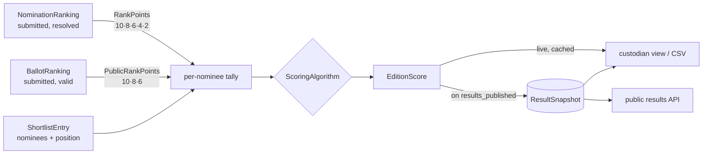

# Scoring & results

How an edition's winners are decided and published. Two modules split the work:

- **`Scoring`** (`app/Modules/Scoring/`) is the **engine**. It turns academy and public rankings into a
  ranked result per category, **computes on demand and stores nothing**.
- **`Results`** (`app/Modules/Results/`) is the **custodian-gated face** of that engine. It serves results
  to the custodian during review, and **freezes an immutable snapshot** the moment the edition's results are
  published, which is also when they become public.

Entity fields (`ResultSnapshot`, `ResultEntry`) are in [domain-model.md](domain-model.md#results);
permissions are in [access-control.md §2g](access-control.md#2g-results-the-results-module).



## 1. When results can be computed

`ComputeCategoryScoresAction::assertScorable()` allows computing only in **`voting_closed`,
`committee_review` and `results_published`**. Before that, the public side is not final, and the request is
a 422 on `status`. Every results endpoint inherits this gate.

## 2. The tally

For each category, `ComputeCategoryScoresAction` builds one row per **shortlisted** nominee. Only
shortlisted nominees can win; academy picks outside the shortlist score nothing.

| Tally field | Source |
| --- | --- |
| `academy_points` | Sum of `RankPoints::forRank()` over **submitted** academy ballots' **resolved** picks — rank 1–5 → 10, 8, 6, 4, 2 |
| `public_points` | Sum of `PublicRankPoints::forRank()` over **submitted, not-cancelled** public ballots — rank 1–3 → 10, 8, 6 |
| `academy_position` | The nominee's position on the shortlist (1–5) |

Academy points are **re-tallied from the raw rankings** every time, not read from the shortlist's `points`
column. So the tally is correct even after an admin has reordered the shortlist.

Both curves live in the `Scoring` root and are the single source of truth: shortlist generation, ballot
validation and reporting all read them from there.

## 3. The algorithms

The tally is handed to a `ScoringAlgorithm`, chosen by **`config('scoring.algorithm')`** (env
`SCORING_ALGORITHM`, read on every resolve). Both algorithms are pure, DB-free, deterministic, and return the
same `NomineeScore` DTO. What its `academyShare` / `publicShare` / `finalScore` fields **mean** depends on
the algorithm.

### `attributed` — the default (client formula)

`AttributedScoreCalculator` maps each side's **ranking** to a fixed ladder of points and adds them:

| Rank | Academy ladder (by shortlist position) | Public ladder (by public-points rank) |
| --- | --- | --- |
| 1 | 200 | 150 |
| 2 | 150 | 100 |
| 3 | 100 | 75 |
| 4 | 75 | 50 |
| 5 | 50 | 25 |

1. **Academy score** — from the nominee's **shortlist position**, so a manual shortlist reorder directly
   changes it.
2. **Public score** — nominees are ranked by `public_points` (ties: better shortlist position first, then
   nominee id), and the rank is looked up on the public ladder. A nominee with no public votes is still
   ranked, and still gets a public score.
3. **Final** = academy score + public score. The highest total wins. Ties go to the higher academy score,
   then to the lower nominee id.

The ladders live in `config/scoring.php` (`attributed.academy` / `attributed.public`). The 60/40 weighting
is **baked into their relative sizes**; the edition's weight columns are ignored. In the output,
`academy_share` / `public_share` hold the two ladder scores and `final_score` their sum: **whole points,
not 0–1 fractions**.

### `share` — alternative

`ScoreCalculator` normalizes each side to its **share of that side's category total**. This makes a few
dozen academy members and thousands of voters comparable. It then weights the shares with the **edition's
own** `academy_vote_weight` / `public_vote_weight` (default 60 / 40):

```
finalScore = (wₐ · academyShare + wₚ · publicShare) / (wₐ + wₚ)          (0..1)
```

To avoid float drift, ranking uses the exact integer key `wₐ · aᵢ · P + wₚ · pᵢ · A` (A and P are the
category totals); the float is for display only. Ties go to more academy points, then more public points,
then the lower nominee id. If a category got **no public votes**, it falls back to academy-only; if it got
no academy points, public-only.

### Choosing

`attributed` is the client-confirmed formula and the default. Switching algorithms changes live results
immediately (after the cache expires, §4), but **never alters an existing snapshot**. Decide before
publishing.

## 4. Caching

`ComputeEditionScoresAction` computes every category in `position` order into an `EditionScore`, cached for
6 hours under `scoring:edition:{id}:{status}`. The inputs cannot change once voting closes, and a status
change produces a new key. The exception is **vote cancellation**: `InvalidateBallotsAction` clears the
edition's keys, so live results reflect a cancellation immediately. Passing `fresh: true` skips the cache.

## 5. Custodian review

`GET /api/admin/editions/{edition}/results` returns the whole edition's results, and
`GET …/results/export` returns the same data as a CSV (`results-edition-{slug}.csv`; columns: category,
position, nominee type and name, both raw points, both share/score fields, final score).

- Permission **`results`** — held by **`custodian` only**. `admin` is deliberately excluded, so no one
  outside the custodian (and `super_admin`) sees complete results before publication.
- Both reads are **audited** (`audited_reads` in `config/audit.php`), which meets the rule that every access
  to final results is recorded. See [audit.md](audit.md).
- `GetEditionResultsAction` is the single read path: it serves the **snapshot if one exists**, otherwise
  computes live. Both produce the same `EditionScore` shape, and `EditionResultsPresenter` adds category and
  nominee names in batched queries (no N+1).

## 6. Publishing and the snapshot

When the edition transitions to **`results_published`**, the `EditionTransitioned` event fires the
`FreezeResultsOnResultsPublished` listener, which runs `PublishEditionResultsAction` **synchronously**:

1. recompute fresh (bypassing the cache);
2. in one transaction, delete any existing snapshot for the edition (entries cascade) and write a new
   `ResultSnapshot` with the edition's weights and `published_at`, plus one `ResultEntry` per nominee per
   category.

The action is idempotent, so re-running it is safe. If the listener ever failed, reads would fall back to
live computation.

From then on the snapshot **is** the result. Later changes, such as switching algorithm or editing weights,
do not touch it. Cancelling a ballot is refused outright once results are published (see
[fraud-monitoring.md §3](fraud-monitoring.md#3-cancelling-votes)), since it could not change the frozen
snapshot either. To change published results, the snapshot has to be regenerated deliberately.

## 7. Public results

`GET /api/results/editions/{edition}` — **unauthenticated**. It is served **only from the snapshot**, and
an edition without one returns **404**. Results therefore become public exactly when they are published,
never before.

## 8. Files

| Concern | Where |
| --- | --- |
| Points curves | `Scoring/RankPoints.php`, `Scoring/PublicRankPoints.php` |
| Tally + gate | `Scoring/Actions/ComputeCategoryScoresAction.php` |
| Edition + cache | `Scoring/Actions/ComputeEditionScoresAction.php` |
| Algorithms | `Scoring/Support/{ScoringAlgorithm,AttributedScoreCalculator,ScoreCalculator}.php`, bound in `AppServiceProvider` |
| Config | `config/scoring.php` |
| Read path | `Results/Actions/GetEditionResultsAction.php`, `Results/Support/EditionResultsPresenter.php` |
| Publish | `Results/Listeners/FreezeResultsOnResultsPublished.php`, `Results/Actions/PublishEditionResultsAction.php` |
| Endpoints | `routes/api/admin/results.php`, `routes/api/results.php` |
