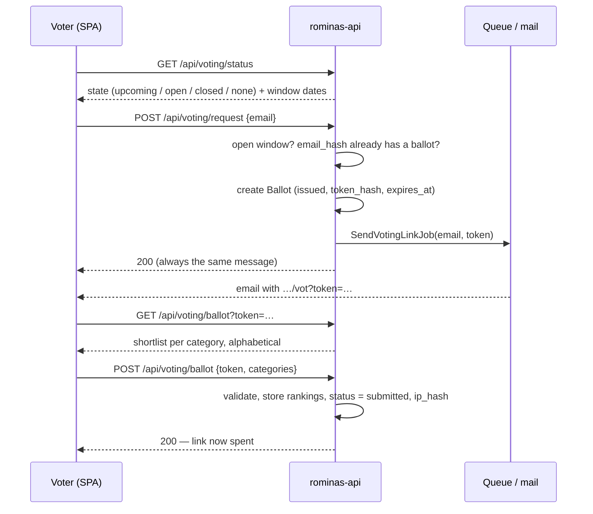

# Public voting

The public half of the Rominas vote. Anyone can request a voting link by email, rank the shortlisted
nominees, and vote **once**. There are no accounts: holding the link's token is the only authorization, and
no plaintext personal data is ever stored.

Everything here lives in `app/Modules/Voting/`. The `Ballot` / `BallotRanking` fields are in
[domain-model.md](domain-model.md#voting); the endpoint summary is in
[access-control.md §2f](access-control.md#2f-public-voting-the-voting-module).



## 1. The open window

Every voting endpoint goes through `ResolveOpenVotingEditionAction`, which requires the active edition to be
**`voting_open`** and now to be within **`[voting_start_at, voting_end_at]`**. Otherwise it returns 422 on
`voting`. This mirrors the academy nomination window; see [edition-lifecycle.md](edition-lifecycle.md).

The rule itself is `VotingState::of($edition, $now)` (`Enums/VotingState.php`), which the gate and the
public status endpoint share:

| State | When |
| --- | --- |
| `none` | no active edition |
| `upcoming` | status `draft` / `nominations_open` / `nominations_closed`, or `voting_open` before `voting_start_at` |
| `open` | status `voting_open` and now within `[voting_start_at, voting_end_at]` |
| `closed` | any later status, or `voting_open` after `voting_end_at` |

Status and dates are checked separately, so a `voting_open` edition can still be `upcoming` or `closed`.

**Public status.** `GET /api/voting/status` (throttled 60/min, never an error) returns
`{state, edition: {name} | null, voting_start_at, voting_end_at}` so the voting frontend can show
"opens on …" or "closed" before anyone requests a link. It exposes nothing else about the edition.

The candidates are the edition's [shortlist](academy.md#6-the-shortlist), which can no longer change once
the edition is `voting_open`.

## 2. Requesting a link

`POST /api/voting/request {email}` — public, throttled to 5/min per email + IP (`voting-request` limiter).
`RequestVotingLinkAction`:

1. resolves the open edition (a closed window is a visible 422);
2. computes `email_hash` = HMAC-SHA256 of the trimmed, lowercased email (`VoterHasher`);
3. if a ballot for that `(edition, email_hash)` already exists, **does nothing**. This rule is **one link,
   ever, per email per edition**, backed by a unique index: no second link, not even after voting, and not
   even if the first email was lost;
4. otherwise generates a 48-character random token and creates a `Ballot` with `status = issued`,
   `token_hash` = SHA-256 of the token, and `expires_at` = the edition's `voting_end_at`;
5. queues `SendVotingLinkJob` **after commit**. The job builds
   `{services.frontend.voting_url}/vot?token=…` and sends it through the `Delivery` pipeline (`voting-link-email`).

The response is always the same generic 200. It never reveals whether the address had already requested a
link or voted.

The plaintext token exists only in the queued job and the email; the database holds its hash.

## 3. Loading the ballot

`GET /api/voting/ballot?token=…` → `ResolveBallotByTokenAction` looks up the ballot by token hash within the
open edition, and accepts it only if it is still **`issued`** and **not expired**. Every failure (unknown,
already used, expired) is **one generic 422** on `token`, so a used link can't be told apart from a wrong
one.

The response (`BallotResource`) lists every category that has a shortlist, with its nominees in
**alphabetical order by name**. The shortlist position, which is the academy's ranking, is never exposed;
it stays secret until results.

## 4. Casting the ballot

`POST /api/voting/ballot`:

```json
{
  "token": "…",
  "categories": [
    { "category_id": 12, "nominees": [34, 7, 19] }
  ]
}
```

The request (`SubmitBallotRequest`) checks the shape; `SubmitBallotAction` applies the rules that depend on
the shortlist:

- **At least one category.** Categories may be skipped; that is how the frontend's multi-step, skippable
  ballot maps onto a single submit.
- Each category must belong to the edition and **have a shortlist**.
- Each category must rank **exactly three distinct shortlisted nominees**, in order of preference
  (`PublicRankPoints::RANKS`), or all of them if the shortlist holds fewer than three.

Any violation is a 422 on `categories`, with a message naming the category (translated per
`Accept-Language`, like every Voting message; see [architecture.md §7](architecture.md#7-localization)). Nothing is written
until every category passes. Then, in **one transaction**, it stores one `BallotRanking` per pick (rank 1 =
favourite), sets the ballot to **`submitted`** with `submitted_at`, and records `ip_hash`, the HMAC of the
submitter's IP. The link is now spent: token resolution only accepts `issued` ballots.

The ballot itself stores ranks only. Points (10 / 8 / 6 for ranks 1–3) are derived later by
[Scoring](scoring-results.md).

## 5. Personal data (GDPR)

| Stored | As | Why |
| --- | --- | --- |
| Email | `email_hash` — HMAC-SHA256, keyed by `voting.pepper` | Enforces one ballot per person without keeping the address |
| IP | `ip_hash` — same HMAC, captured at submit | Fraud signal (shared-IP detection) |
| Link token | `token_hash` — SHA-256 | Authorizes the ballot; the token itself only ever travels by email |

`voting.pepper` reads **`VOTING_PEPPER`**, falling back to `APP_KEY`. **Set a dedicated value in
production and never rotate it once ballots exist.** Rotating it makes every existing `email_hash` stop
matching, which would let everyone request a second link. (This is stricter than the audit module's pepper,
where rotation only breaks correlation.)

None of the public voting routes are in the [audit trail](audit.md); the ballot row is its own record.

**The IP must be the voter's, not a proxy's.** The voting frontend calls the API through its own Next.js
server (a same-origin rewrite of `/api/voting/*`), so the API's direct caller is that server. Next forwards
the client address in `X-Forwarded-For` (keeping one set by an upstream proxy), and Laravel's
`TrustProxies` honours it only from addresses listed in **`TRUSTED_PROXIES`** (`config/trustedproxy.php`;
comma-separated IPs/CIDRs, or `*`). Unset, every ballot would hash the Next server's IP and shared-IP fraud
detection would flag them all. In production (Cloudflare → Next → API) trust the Next host, and make sure
Next itself sees the real client: trust Cloudflare's ranges at that hop, or have the edge set
`X-Forwarded-For` from `CF-Connecting-IP`. Use `*` only when the API is reachable solely through trusted
proxies, since otherwise anyone can forge the header.

## 6. After submission

- **Fraud monitoring** reviews submitted ballots, flags suspicious clusters, and can **cancel** ballots in
  reasoned batches. A cancelled ballot keeps its data but gets an `invalidation_batch_id`, and the
  `->valid()` scope removes it from every tally. See [fraud-monitoring.md](fraud-monitoring.md).
- **Scoring** counts only submitted, valid ballots, from `voting_closed` onward. See
  [scoring-results.md](scoring-results.md).
- **Reporting** counts votes per category per day and cancellations per day. See
  [reporting.md](reporting.md).

## 7. Files

| Concern | Where |
| --- | --- |
| Window gate | `Actions/ResolveOpenVotingEditionAction.php`, `Enums/VotingState.php` |
| Public status | `Controllers/VotingStatusController.php`, `Actions/ResolveVotingStatusAction.php`, `Resources/VotingStatusResource.php` |
| Link request | `Actions/RequestVotingLinkAction.php`, `Jobs/SendVotingLinkJob.php`, `Delivery/SMTP/SmtpVotingLinkEmailPayloadFactory.php` |
| Token → ballot | `Actions/ResolveBallotByTokenAction.php` |
| Submit | `Actions/SubmitBallotAction.php`, `Requests/SubmitBallotRequest.php` |
| Ballot payload | `Resources/BallotResource.php` |
| Hashing | `Support/VoterHasher.php`, `config/voting.php`, `config/trustedproxy.php` (real client IP) |
| Routes | `routes/api/voting/public.php` |
